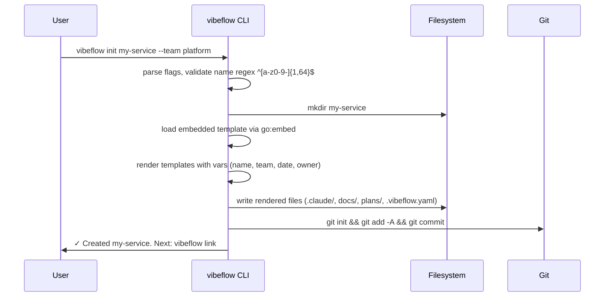
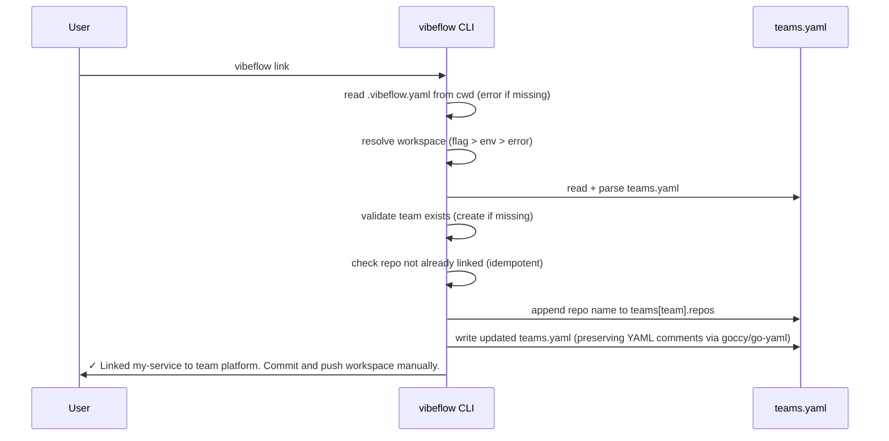
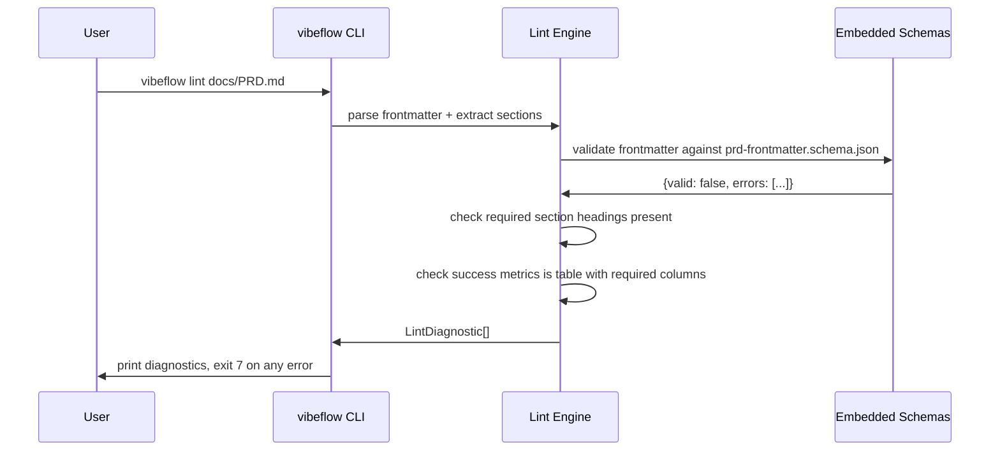

# Vibeflow CLI — Go binary with 3 commands

## Overview

Single static Go binary `vibeflow` providing project scaffolding, lint validation, workspace registration, and Claude Code MCP server setup. Ships with JSON schemas + project template + MCP stdio server binary all embedded via `go:embed`. Zero external dependencies at runtime except `git` (for init hook). Cross-platform: macOS (arm64/amd64), Linux (arm64/amd64), Windows (amd64).

## API Contracts

```yaml
commands:
  - name: init
    usage: vibeflow init <name> [flags]
    flags:
      --team: string              # team slug, defaults to "default"
      --description: string       # one-liner, defaults to ""
      --yes: bool                 # skip confirmation prompts
      --dry-run: bool             # show changes without writing
    exit_codes:
      0: success
      1: general error
      2: invalid flags or name
      3: directory already exists
    side_effects:
      - creates ./<name>/ directory
      - renders embedded template files
      - runs `git init` + initial commit (unless --no-git)

  - name: link
    usage: vibeflow link [flags]
    flags:
      --workspace: string         # path to workspace meta-repo (overrides VIBEFLOW_WORKSPACE env)
      --team: string              # team slug in teams.yaml to register under
      --dry-run: bool
    exit_codes:
      0: success
      1: general error
      2: not in a vibeflow repo (no .vibeflow.yaml)
      3: workspace not found
      4: repo already linked
    side_effects:
      - appends current repo name to workspace/teams.yaml under specified team
      - does NOT commit — user commits manually

  - name: lint
    usage: vibeflow lint [path]
    flags:
      --format: text|json|github-annotations   # default text
      --fix: bool                              # auto-fix trivial issues
    exit_codes:
      0: valid
      1: general error
      7: validation failed (lint errors)
    side_effects:
      - if --fix: writes corrections to files in place
      - otherwise: read-only, prints diagnostics

  - name: claude setup
    usage: vibeflow claude setup [flags]
    flags:
      --dry-run: bool
    exit_codes:
      0: success
      1: general error
    side_effects:
      - reads ~/.claude/settings.json (creates if missing)
      - adds/updates mcpServers.vibeflow entry
      - does NOT restart Claude Code (user must)

  - name: version
    usage: vibeflow version
    output: semver string + git commit + go version

  - name: help
    usage: vibeflow help [command]
```

## Data Models

```typescript
// Repo-local config (written by `init`, read by `link`/`lint`/MCP server)
interface VibeflowYaml {
  schema_version: "1.0";
  project: {
    name: string;
    kind: "code";                 // only "code" in MVP
    team: string;                 // defaults to "default"
    description?: string;
    created: string;              // ISO date
  };
  links?: {
    epic?: string;                // EPIC-xxx ref (optional)
  };
}

// Workspace-level config (user-edited, committed to meta-repo)
interface TeamsYaml {
  schema_version: "1.0";
  workspace: {
    name: string;
  };
  teams: Record<string, {
    name?: string;
    description?: string;
    repos: string[];              // repo names (directories inside workspace)
  }>;
}

// Global config (flags > env > ~/.config/vibeflow/config.yaml > defaults)
interface CliConfig {
  workspace?: string;             // path to meta-repo
  default_team?: string;
  editor?: string;                // for future `vibeflow edit` commands
}

// Lint diagnostic
interface LintDiagnostic {
  file: string;
  line?: number;
  column?: number;
  severity: "error" | "warning" | "info";
  rule: string;                   // e.g. "prd-required-frontmatter"
  message: string;
  hint?: string;
}
```

## Component Flow







## Edge Cases

- **init**: directory already exists → error exit 3 unless `--force` (MVP: no `--force`, just error)
- **init**: invalid name (has spaces, uppercase, special chars) → error exit 2, show regex
- **link**: not in vibeflow repo → error with hint "run `vibeflow init` first"
- **link**: workspace env var unset and no `--workspace` flag → error with hint "set VIBEFLOW_WORKSPACE"
- **link**: teams.yaml has YAML syntax error → print error, don't overwrite
- **link**: repo already in teams.yaml → idempotent success (exit 0, message "already linked")
- **lint**: no PRD file found → skip (exit 0) with warning
- **lint**: PRD has no frontmatter at all → exit 7, error "missing frontmatter"
- **lint**: frontmatter has extra unknown fields → warning, not error (forward-compat)
- **lint --fix**: missing `schema_version` or `created` → auto-insert
- **lint**: markdown parse error (unterminated code block) → error with line hint
- **claude setup**: `~/.claude/settings.json` is malformed JSON → refuse to overwrite, print path
- **claude setup**: entry already exists with same config → idempotent, exit 0 "up to date"
- **claude setup**: vibeflow binary not found in PATH → warn, but write config anyway (let Claude Code surface error at runtime)
- **All commands**: symlinks in target paths → follow, don't clobber
- **Windows**: path separators, line endings — use `filepath.ToSlash` in YAML writes, `\r\n` in lint for original files
- **Concurrent runs**: CLI is stateless, no locking needed. Last writer wins on teams.yaml (user's problem to coordinate).

## Testing Strategy

- **Unit**: parser (frontmatter, sections, tables) — adversarial inputs (malformed YAML, unterminated markdown, CR/LF mix)
- **Unit**: schema validator (valid + invalid fixtures per schema)
- **Unit**: template renderer (template variable injection attempts: `$()`, backticks, newlines in name)
- **Integration**: full `init` → `link` → `lint` flow on a temp dir with fresh git
- **Integration**: `claude setup` with existing and missing `~/.claude/settings.json`
- **Cross-platform CI**: GitHub Actions matrix darwin-arm64, darwin-amd64, linux-amd64, linux-arm64, windows-amd64
- **E2E**: dogfood — run CLI on `vibeflow` repo itself, validate own PRD lints clean

## Performance Requirements

- Cold start < 100ms on modern laptop (Go native, no JIT)
- `vibeflow init` total time < 2s including `git init` + initial commit
- `vibeflow lint` on a 10k-word PRD < 200ms
- Binary size < 20 MB (embedded schemas + template + MCP server binary if colocated)
- Memory < 50 MB RSS during any command

## Security Considerations

- **Template injection defense**: strict regex on `project_name` (`^[a-z0-9-]{1,64}$`), `team` (`^[a-z0-9-]{1,64}$`), `description` (stripped of control chars). Validated at flag parse, not at render time.
- **Shell command safety**: git commit messages passed via `-F` with temp file, not inline `-m "$(...)"`. No `os/exec` with shell=true.
- **Path traversal defense**: refuse `init` names containing `..`, `/`, `\`, or absolute paths.
- **YAML safety**: use `gopkg.in/yaml.v3` with strict decoding (no anchors, bounded depth). Reject documents > 1 MB.
- **Schema download**: schemas are embedded, NEVER fetched from network. No DNS lookups at runtime.
- **Credentials**: CLI does NOT handle any credentials in MVP. No OAuth, no tokens, no secrets.
- **File permissions**: scaffolded `.gitignore` excludes `.env*`, `*.pem`, `*.key`, `token.json` by default.
- **`claude setup`**: when writing `~/.claude/settings.json`, preserve other `mcpServers` entries (read-merge-write pattern, not clobber).
- **Reproducible builds**: `go build -trimpath -ldflags "-s -w"` for release binaries. Signed with cosign if time permits (post-MVP).

## Rollback Plan

- Each release tagged `v0.x.y`. Homebrew tap serves old versions.
- `vibeflow init` is idempotent on a clean dir — rollback = `rm -rf`.
- `vibeflow link` appends one line — rollback = manual edit of `teams.yaml`.
- `vibeflow lint` is read-only — no rollback needed.
- `vibeflow claude setup` is idempotent — rollback = manual edit of `~/.claude/settings.json`.

## Implementation Notes

**Module layout** (Go):
```
cli/
├── main.go
├── cmd/
│   ├── root.go
│   ├── init.go
│   ├── link.go
│   ├── lint.go
│   ├── claude.go        (claude setup subcommand)
│   └── version.go
├── internal/
│   ├── config/          (CliConfig loading)
│   ├── workspace/       (detect, read teams.yaml)
│   ├── template/        (embedded template render)
│   ├── schema/          (ajv-like validator wrapper)
│   ├── lint/            (PRD/spec rule engine)
│   ├── gitops/          (shellout to `git` binary)
│   └── errors/          (typed errors + hints)
├── templates/           (go:embed)
│   └── code/
│       └── default/
│           ├── .claude/CLAUDE.md.tmpl
│           ├── docs/PRD.md.tmpl
│           ├── docs/specs/.gitkeep
│           ├── docs/wiki/.gitkeep
│           ├── plans/.gitkeep
│           ├── .vibeflow.yaml.tmpl
│           ├── .gitignore.tmpl
│           └── README.md.tmpl
├── schemas/             (go:embed)
│   ├── prd-frontmatter.schema.json
│   ├── spec-frontmatter.schema.json
│   ├── teams-yaml.schema.json
│   └── vibeflow-yaml.schema.json
├── go.mod
└── go.sum
```

**Dependencies** (minimal):
- `github.com/spf13/cobra` — command framework
- `github.com/santhosh-tekuri/jsonschema/v5` — JSON schema validation
- `gopkg.in/yaml.v3` — YAML parsing
- `github.com/goccy/go-yaml` — YAML parsing that preserves comments (for `link` edit path)
- Standard library for everything else (no lipgloss, no survey, no viper for MVP)
