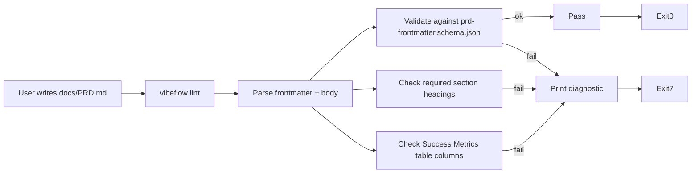

# Vibeflow Standards — PRD/spec schemas + repo conventions

## Overview

The machine-readable contracts that CLI + MCP server both validate against. Four JSON schemas (PRD frontmatter, spec frontmatter, `.vibeflow.yaml`, `teams.yaml`), two markdown templates (PRD, spec), and a documented repo layout convention. All embedded in CLI binary via `go:embed`. No separate meta-template repo.

## API Contracts

These are not HTTP APIs but file-format contracts:

```yaml
schemas:
  - id: prd-frontmatter.schema.json
    version: "1.0"
    consumers: [cli lint, mcp workspace_context]
    location: cli/schemas/prd-frontmatter.schema.json

  - id: spec-frontmatter.schema.json
    version: "1.0"
    consumers: [cli lint]
    location: cli/schemas/spec-frontmatter.schema.json

  - id: vibeflow-yaml.schema.json
    version: "1.0"
    consumers: [cli init, cli link, cli lint, mcp workspace_context]
    location: cli/schemas/vibeflow-yaml.schema.json

  - id: teams-yaml.schema.json
    version: "1.0"
    consumers: [cli link, mcp workspace_context, mcp list_projects]
    location: cli/schemas/teams-yaml.schema.json

markdown_templates:
  - prd-template.md             # rendered by `vibeflow init` into repo docs/PRD.md
  - spec-template.md            # reference, not auto-rendered (user creates via editor)

repo_layout_convention:         # documented, enforced loosely by lint
  - .vibeflow.yaml              # required
  - docs/PRD.md                 # recommended, lint warns if missing
  - docs/specs/*.md             # optional
  - docs/wiki/**/*.md           # optional
  - .claude/CLAUDE.md           # created by init, hand-edited by user
```

## Data Models

### PRD Frontmatter Schema (v1.0)

`cli/schemas/prd-frontmatter.schema.json`:

```json
{
  "$schema": "http://json-schema.org/draft-07/schema#",
  "type": "object",
  "required": ["id", "title", "status", "owner", "repo", "schema_version"],
  "additionalProperties": false,
  "properties": {
    "id":             { "type": "string", "pattern": "^PRD-[a-z0-9-]+$" },
    "title":          { "type": "string", "minLength": 5, "maxLength": 120 },
    "status":         { "enum": ["draft", "review", "approved", "shipped", "archived", "cancelled"] },
    "owner":          { "type": "string", "minLength": 1 },
    "reviewers":      { "type": "array", "items": { "type": "string" } },
    "target_quarter": { "type": "string", "pattern": "^Q[1-4]-\\d{4}$" },
    "repo":           { "type": "string", "minLength": 1 },
    "epic":           { "type": "string", "pattern": "^EPIC-\\d{3,}$" },
    "schema_version": { "enum": ["1.0"] },
    "created":        { "type": "string", "format": "date" },
    "updated":        { "type": "string", "format": "date" },
    "tags":           { "type": "array", "items": { "type": "string" }, "maxItems": 10 }
  }
}
```

Note: `enum: ["1.0"]` NOT `const: "1.0"` — per red team finding, allows future evolution.

### Spec Frontmatter Schema (v1.0)

`cli/schemas/spec-frontmatter.schema.json`:

```json
{
  "$schema": "http://json-schema.org/draft-07/schema#",
  "type": "object",
  "required": ["id", "title", "status", "owner", "prd", "repo", "schema_version"],
  "additionalProperties": false,
  "properties": {
    "id":             { "type": "string", "pattern": "^SPEC-[a-z0-9-]+$" },
    "title":          { "type": "string", "minLength": 5, "maxLength": 120 },
    "status":         { "enum": ["draft", "review", "approved", "shipped", "archived"] },
    "owner":          { "type": "string", "minLength": 1 },
    "prd":            { "type": "string", "pattern": "^PRD-[a-z0-9-]+$" },
    "repo":           { "type": "string", "minLength": 1 },
    "components":     { "type": "array", "items": { "type": "string" } },
    "schema_version": { "enum": ["1.0"] }
  }
}
```

### `.vibeflow.yaml` Schema (v1.0)

`cli/schemas/vibeflow-yaml.schema.json`:

```json
{
  "$schema": "http://json-schema.org/draft-07/schema#",
  "type": "object",
  "required": ["schema_version", "project"],
  "additionalProperties": false,
  "properties": {
    "schema_version": { "enum": ["1.0"] },
    "project": {
      "type": "object",
      "required": ["name", "kind"],
      "additionalProperties": false,
      "properties": {
        "name":        { "type": "string", "pattern": "^[a-z0-9-]{1,64}$" },
        "kind":        { "enum": ["code"] },
        "team":        { "type": "string", "default": "default" },
        "description": { "type": "string", "maxLength": 200 },
        "created":     { "type": "string", "format": "date" }
      }
    },
    "links": {
      "type": "object",
      "additionalProperties": false,
      "properties": {
        "epic": { "type": "string", "pattern": "^EPIC-\\d{3,}$" }
      }
    }
  }
}
```

Note: `kind` enum has only `"code"` in MVP. Phase 5+ will extend via minor bump.

### `teams.yaml` Schema (v1.0)

`cli/schemas/teams-yaml.schema.json`:

```json
{
  "$schema": "http://json-schema.org/draft-07/schema#",
  "type": "object",
  "required": ["schema_version", "workspace", "teams"],
  "additionalProperties": false,
  "properties": {
    "schema_version": { "enum": ["1.0"] },
    "workspace": {
      "type": "object",
      "required": ["name"],
      "properties": {
        "name":        { "type": "string", "minLength": 1 },
        "description": { "type": "string" }
      }
    },
    "teams": {
      "type": "object",
      "patternProperties": {
        "^[a-z0-9-]+$": {
          "type": "object",
          "required": ["repos"],
          "additionalProperties": false,
          "properties": {
            "name":        { "type": "string" },
            "description": { "type": "string" },
            "repos":       { "type": "array", "items": { "type": "string" }, "uniqueItems": true }
          }
        }
      },
      "additionalProperties": false
    }
  }
}
```

## Markdown Templates

### PRD Template

Required sections (enforced by `vibeflow lint`): **Problem**, **Users**, **Success Metrics** (must contain table with columns `metric | baseline | target | measurement`), **Scope**, **Non-Goals**.

Optional: **User Flows**, **Dependencies**, **Open Questions**, **Rollout**, **Risks**.

```markdown
---
id: PRD-<repo-slug>-<feature>
title: <Feature Title>
status: draft
owner: <email-or-handle>
reviewers: []
target_quarter: Q2-2026
repo: <repo-name>
schema_version: "1.0"
created: 2026-04-14
tags: []
---

# <Feature Title>

## Problem
<!-- User pain or business need. Specific. At least 20 words. -->

## Users
<!-- Primary + secondary. Use personas if they exist. -->

## Success Metrics
<!-- Machine-parseable TABLE. Lint requires all 4 columns. -->
| Metric | Baseline | Target | Measurement |
|---|---|---|---|
| <metric> | <current> | <goal> | <how measured> |

## Scope
<!-- In-scope bullets. Explicit. -->

## Non-Goals
<!-- Out-of-scope. Prevents creep. At least 2 items recommended. -->

## Dependencies
<!-- Other repos, teams, services. Include owner + ETA. -->

## Open Questions
<!-- Must be empty or absent when status=approved. -->
```

### Spec Template

Required sections: **Overview**, **API Contracts**, **Data Models**, **Edge Cases**.

Optional: **Component Flow**, **Testing Strategy**, **Performance Requirements**, **Security Considerations**, **Rollback Plan**.

```markdown
---
id: SPEC-<repo-slug>-<component>
title: <Component Title>
status: draft
owner: <email-or-handle>
prd: PRD-<matching-prd-id>
repo: <repo-name>
schema_version: "1.0"
components: []
---

# <Component Title>

## Overview
<!-- 2-3 sentences. -->

## API Contracts
<!-- Machine-parseable. Use YAML or typescript code blocks. -->

## Data Models
<!-- Use typescript interfaces or json-schema. -->

## Edge Cases
<!-- List each edge case with expected behavior. -->
```

## Component Flow



## Edge Cases

### Schema validation edge cases

- **Missing frontmatter block**: lint exits 7, error `prd-missing-frontmatter`.
- **Frontmatter has trailing `---` but no fields**: lint exits 7, error `prd-empty-frontmatter`.
- **`schema_version` missing**: lint exits 7, error with hint "add `schema_version: \"1.0\"`".
- **`schema_version` is numeric `1.0` not string `"1.0"`**: accept (YAML coerces), normalize on `--fix`.
- **Status transition `approved` with non-empty Open Questions**: lint exits 7, error `prd-approved-requires-clean-questions`.
- **Metrics table missing one column**: lint exits 7, error `prd-metrics-table-columns` with column list.
- **Metrics table has extra columns**: warning, not error.
- **Required section heading at wrong level** (e.g. `# Problem` instead of `## Problem`): warning, not error.
- **Required section has < 20 words body**: warning `prd-section-too-short`.
- **Non-ASCII in frontmatter string values**: accept, UTF-8 preserved.
- **Windows CRLF line endings**: accept, internal normalize to LF for parsing.
- **BOM at file start**: strip before YAML parse.
- **Duplicate frontmatter keys**: YAML parser rejects, surface as error.

### Repo layout edge cases

- **`.vibeflow.yaml` missing in repo**: `vibeflow link` errors out, `vibeflow lint` warns "not a vibeflow repo".
- **Repo linked to multiple teams** (duplicate in `teams.yaml`): `vibeflow link` errors with hint; user must manually pick.
- **Workspace has orphan repo dir not in `teams.yaml`**: `vibeflow lint --workspace` (future) warns.
- **`kind: code` only in MVP**: lint rejects `kind: product` or `kind: design` with "not in MVP, see Phase 5+".

## Testing Strategy

- **Unit**: each JSON schema validated against ajv/go-jsonschema lib with 3 fixture sets:
  - `fixtures/valid/` — minimum viable doc, maximum fields doc
  - `fixtures/invalid/` — missing required, wrong type, wrong enum, wrong regex
  - `fixtures/edge/` — BOM, CRLF, UTF-8, trailing whitespace, duplicate keys
- **Unit**: markdown parser extracts frontmatter + sections correctly (gray-matter or internal parser)
- **Unit**: section presence checker identifies required headings case-insensitively
- **Unit**: metrics table parser extracts columns + rows from pipe-syntax markdown
- **Integration**: full `vibeflow init && vibeflow lint` on scaffolded repo → must pass clean
- **Integration**: manually mutate PRD to inject each failure mode → lint exits 7 with correct error code
- **Dogfood**: run `vibeflow lint docs/PRD-vibeflow-mvp.md` on this repo → must pass

## Performance Requirements

- Schema loading (embedded): < 10ms (parsed once at CLI startup, cached)
- Single PRD lint: < 100ms for 500-line doc
- Workspace-wide lint (10 repos × 5 files each): < 2s total
- Schema validation error output: < 5ms to format + print

## Security Considerations

- **Schema injection via YAML**: strict YAML parsing, reject YAML anchors + aliases (prevents billion-laughs attack). Max document size 100 KB for frontmatter, 1 MB for full file.
- **Path in `repo` field**: treat as opaque string (no filesystem resolution via `repo`). Prevent path traversal.
- **Embedded schema tampering**: schemas ship inside binary. Binary signed (cosign, post-MVP). Rebuild to change schemas.
- **No secrets in PRD/spec**: document explicitly — PRDs are indexed by MCP server and returned to Claude. Any API key in a PRD WILL leak to Claude's context. Convention: `.env` for secrets, PRDs for product docs only.
- **Schema version pinning**: `schema_version: "1.0"` is a contract. Future minor versions (1.1) add optional fields only, never break existing. Major (2.0) gated behind CLI version bump + migration tool.

## Rollback Plan

- Schemas embedded in CLI binary — rollback = install previous CLI version. Old binary reads old schemas.
- No database migration to undo.
- `.vibeflow.yaml` files written by init are trivial to hand-edit for emergency rollback.
- teams.yaml is user-owned file, user has full control.

## Implementation Notes

### Lint rules (non-schema validation)

Beyond JSON schema validation, lint enforces these semantic rules:

| Rule ID | Severity | Description |
|---|---|---|
| `prd-required-frontmatter` | error | Frontmatter block present and parses |
| `prd-required-sections` | error | All of: Problem, Users, Success Metrics, Scope, Non-Goals |
| `prd-metrics-must-be-table` | error | Success Metrics section contains pipe-syntax table |
| `prd-metrics-table-columns` | error | Table columns include metric, baseline, target, measurement |
| `prd-approved-clean-questions` | error | If status=approved, Open Questions section is empty or absent |
| `prd-problem-min-length` | warn | Problem section has ≥ 20 words |
| `prd-non-goals-minimum` | warn | Non-Goals section has ≥ 2 items |
| `prd-updated-staleness` | warn | `updated` field is within last 90 days (unless status in [shipped, archived]) |
| `spec-required-frontmatter` | error | Frontmatter present and parses |
| `spec-required-sections` | error | All of: Overview, API Contracts, Data Models, Edge Cases |
| `spec-prd-link` | error | `prd` field references a PRD that exists in repo |
| `vibeflow-yaml-required` | error | `.vibeflow.yaml` exists and parses |
| `vibeflow-yaml-name-matches-dir` | warn | `project.name` matches parent directory name |

### Progressive enforcement (post-MVP)

MVP ships advisory only (lint prints, user chooses pre-commit hook or not). Future versions may add:

- `block_new`: new PRDs must pass lint
- `block_edit`: editing existing PRDs triggers lint
- `ci_gate`: PRs touching PRD/spec fail CI on errors

All controlled via `.vibeflow.yaml` or global config. Not in MVP scope.

### File locations in CLI binary

```
cli/
├── schemas/                                  (embedded via go:embed)
│   ├── prd-frontmatter.schema.json
│   ├── spec-frontmatter.schema.json
│   ├── vibeflow-yaml.schema.json
│   └── teams-yaml.schema.json
└── templates/                                (embedded via go:embed)
    └── code/
        └── default/
            ├── docs/PRD.md.tmpl              (rendered on init)
            └── (other template files)
```

Schemas NOT modifiable by end users. Customization deferred to post-MVP plugin model.
