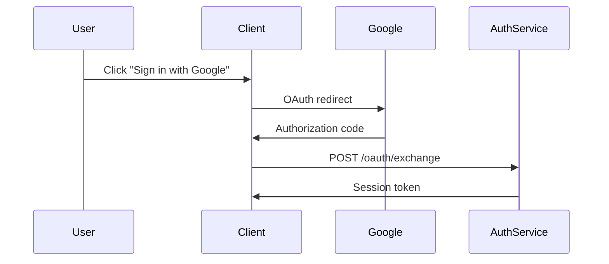

# Vibeflow — Enterprise AI Vibe-Coding Workflow

Brainstorm output. Design finalized, ready for `/ck:plan`.

## 1. Problem Statement

Doanh nghiệp lớn chạy nhiều team phát triển sản phẩm song song. Khi AI coding (Claude Code) được adopt rộng, 4 pain point nổi lên:

1. **Context fragmentation** — team A không biết team B làm gì. Claude Code ở repo A mù về API contract của repo B.
2. **PRD/specs mỗi người viết 1 kiểu** — Claude output không đồng bộ, review khó.
3. **Không track ai đang vibe code gì** — lead mất visibility, conflict không phát hiện sớm.
4. **Knowledge base không AI-readable** — wiki cũ (Confluence/Notion) Claude không đọc được, mỗi session phải re-explain.

Cần workflow + tooling chuẩn hoá để team phối hợp, share context, và tối ưu sức mạnh vibe coding ở scale org.

## 2. Requirements

**Functional**
- Scaffold repo mới từ template chuẩn (PRD, specs, `.claude/`, kanban, wiki)
- Workspace-level view: epic cross-team, task cross-repo
- LLM-native wiki: Claude Code query qua MCP, semantic + full-text search
- Lint enforcement: PRD/specs theo schema bắt buộc
- Dashboard read-only cho lead: board, wiki browser, compliance view
- Cross-repo context: Claude ở repo A đọc được wiki/spec repo B (theo permission)

**Non-functional**
- Git-native: mọi state là file `.md`/`.yaml` trong git → versioned, portable, offline-capable
- Self-hosted: 1 instance / department, SSO + RBAC
- Scalable: start 1 meta-repo, scale lên multi-department sau
- Zero vendor lock-in: nếu gỡ Vibeflow, repo vẫn dùng được bình thường

## 3. Approaches Considered

| Approach | Pros | Cons | Verdict |
|---|---|---|---|
| **A. Pure convention (no code)** | Zero infra | Drift nhanh, không track được | ❌ Không giải pain #3, #4 |
| **B. Custom web platform (heavy)** | Control cao, UX tốt | Build 6+ tháng, vendor lock-in, không AI-native | ❌ Over-engineered |
| **C. Git-native + MCP server + dashboard (Hybrid)** | AI-native, portable, versioned, Claude Code đọc trực tiếp | Infra burden (Postgres, server, sync) | ✅ Chosen |
| **D. DB-backed state (Postgres truth)** | Query nhanh, realtime | Claude phải qua MCP mới đọc được, mất git history | ❌ Chống lại Claude Code strength |

**Chosen: Approach C — Git as Truth, MCP as Bridge.**

Lý do: Claude Code mạnh nhất khi đọc file trực tiếp. Git cho versioning + portability free. MCP server chỉ là lớp index + cross-repo join + write-through-PR.

## 4. Final Architecture

### 4.1 Topology

```
┌─────────────────────────────────────────────────────────────┐
│                    VIBEFLOW WORKSPACE                       │
│                                                             │
│  ┌──────────────┐         ┌────────────────────────────┐   │
│  │ meta-repo    │         │  product repos (N)         │   │
│  │ (workspace)  │         │  ┌────────┐ ┌────────┐    │   │
│  │              │         │  │ repo-a │ │ repo-b │... │   │
│  │ epics/       │         │  └────────┘ └────────┘    │   │
│  │ wiki/        │◄────────┤  each has:                 │   │
│  │ teams.yaml   │  links  │  .claude/, docs/, plans/   │   │
│  │ standards/   │         │                            │   │
│  └──────┬───────┘         └──────────┬─────────────────┘   │
│         │                            │                     │
│         └────────────┬───────────────┘                     │
│                      ▼                                      │
│            ┌──────────────────┐                            │
│            │ Vibeflow Server  │  (self-hosted, central)    │
│            │ ──────────────── │                            │
│            │ • Git sync (poll)│                            │
│            │ • Postgres index │                            │
│            │ • Gemini embeds  │                            │
│            │ • MCP server     │                            │
│            │ • Next.js board  │                            │
│            │ • SSO/RBAC       │                            │
│            └────────┬─────────┘                            │
│                     │                                       │
│      ┌──────────────┼──────────────┐                       │
│      ▼              ▼              ▼                       │
│  Claude Code    Dashboard      vibeflow CLI                │
│  (via MCP)      (browser)      (Go binary)                 │
└─────────────────────────────────────────────────────────────┘
```

### 4.2 Tech Stack

| Component | Tech | Lý do |
|---|---|---|
| CLI | **Go** | Single static binary, zero install friction, enterprise-friendly distribution |
| MCP server | **Node/TS** | `@modelcontextprotocol/sdk` mature nhất ở TS |
| Dashboard | **Next.js** (TS) | Cùng repo với MCP server, reuse types |
| DB | **Postgres 16** | FTS built-in, `pgvector` cho embeddings |
| Embeddings | **Gemini `text-embedding-004`** | Free tier đủ cho department scale, nhẹ |
| Git sync | **Polling** (30s interval) | Đơn giản hơn webhook, sẽ migrate sau nếu cần |
| Auth | **OIDC/SAML** | SSO enterprise standard, RBAC via `teams.yaml` + IdP groups |
| Deploy | **Docker Compose** | 1 instance / department, dễ setup |

**Shared contract**: JSON schema files cho `kanban.yaml`, `epic.md` frontmatter, `teams.yaml`, PRD template → Go CLI + Node server cùng validate.

### 4.3 Meta-repo Structure

```
workspace/                          ← 1 per department (scalable later)
├── epics/
│   ├── EPIC-001-auth-platform.md
│   └── EPIC-002-billing-revamp.md
├── wiki/
│   ├── architecture/
│   ├── decisions/                  (cross-team ADRs)
│   └── glossary.md
├── standards/
│   ├── prd-template.md             (schema + required sections)
│   ├── spec-template.md
│   ├── review-checklist.md
│   └── schemas/                    (JSON schemas shared across CLI+server)
│       ├── kanban.schema.json
│       ├── epic-frontmatter.schema.json
│       └── teams.schema.json
├── plugins/                        (dept override — see §4.9)
│   └── platform-team/
│       └── prd-template.md         (override standards)
├── teams.yaml                      (team → repos → members → RBAC)
└── .vibeflow/
    └── config.yaml                 (workspace-level config)
```

### 4.4 Product Repo Template

```
my-repo/
├── .claude/
│   ├── CLAUDE.md                   (references workspace via MCP)
│   ├── agents/                     (inherited, overridable)
│   └── skills/
├── docs/
│   ├── PRD.md                      (follows standards/prd-template)
│   ├── specs/                      (per-feature specs)
│   ├── adr/                        (repo-local decisions)
│   └── wiki/                       (repo-local knowledge)
├── plans/
│   └── kanban.yaml                 (tasks linked to workspace epics)
└── .vibeflow.yaml                  (repo metadata, epic links, team)
```

### 4.5 Two-tier Kanban Model

**Tier 1 — Workspace Epic** (`meta-repo/epics/EPIC-042-unified-auth.md`):
```yaml
---
id: EPIC-042
title: Unified Auth Platform
status: in-progress              # proposed|approved|in-progress|done|cancelled
owner: team-platform
repos: [auth-service, web-app, mobile-app]
quarter: Q2-2026
linked_tasks:
  - { repo: auth-service, task: PLAN-2026-04-14-oauth }
  - { repo: web-app, task: PLAN-2026-04-15-login-ui }
---
# Problem
# Success metrics
# Dependencies
```

**Tier 2 — Per-repo Task** (`repo/plans/kanban.yaml`):
```yaml
tasks:
  - id: PLAN-2026-04-14-oauth
    epic: EPIC-042
    status: in-progress           # todo|planning|research|impl|review|done
    assignee: alice
    owner_agent: claude-code
    linked_prs: [#123]
    created: 2026-04-14
```

**Merge conflict mitigation**: mỗi task sinh ra 1 file riêng `plans/tasks/PLAN-xxx.yaml` thay vì nhét chung file. Git auto-merge tự nhiên. `kanban.yaml` chỉ là index generated.

### 4.6 LLM Wiki Model

- Parse `.md` theo heading → chunks (max ~800 tokens)
- Index Postgres FTS + Gemini embeddings (`text-embedding-004`)
- `wiki_search(query, scope)` trả top-k chunks + file path + last_modified
- Scope: `workspace` | `repo:<name>` | `all` (theo RBAC)
- Wiki link resolution: `[[UserAuth]]` → MCP tool resolve canonical path
- Staleness warning: trả về `age_days`, Claude tự warn nếu > 90

### 4.7 MCP Tools Catalog

| Tool | Mục đích | Write |
|---|---|---|
| `workspace_context(repo)` | Epic hiện tại, team, linked repos, standards | R |
| `epic_get(id)` / `epic_list(filter)` | Đọc epic | R |
| `kanban_query(repo?, assignee?, status?)` | Query tasks cross-repo | R |
| `wiki_search(query, scope)` | FTS + semantic search | R |
| `wiki_resolve_link(name)` | `[[UserAuth]]` → file path | R |
| `prd_get(repo)` / `prd_validate(repo)` | Đọc/lint PRD | R |
| `spec_get(repo, feature)` | Đọc spec file | R |
| `cross_repo_search(query)` | Search code/docs across repos | R |
| `team_members(repo)` / `team_contact(name)` | Ownership | R |
| `epic_update_status(id, status)` | Commit PR to meta-repo | W |
| `task_create(repo, task)` | Commit PR to product repo | W |
| `force_sync(repo)` | Trigger sync ngay (khi cần fresh data) | — |

**Write path**: MCP write tool → tạo branch → commit → mở PR → merge (auto nếu có permission) → reindex. **Không ghi trực tiếp vào DB.**

### 4.8 PRD Standard (example schema)

`standards/schemas/prd-frontmatter.schema.json`:
```json
{
  "required": ["status", "owner", "reviewers", "target_quarter", "repo"],
  "properties": {
    "status": { "enum": ["draft", "review", "approved", "shipped", "archived"] },
    "target_quarter": { "pattern": "^Q[1-4]-\\d{4}$" }
  }
}
```

`standards/prd-template.md` required sections:
```
# <Title>
## Problem           (required)
## Users             (required)
## Success Metrics   (required)
## Scope             (required)
## Non-Goals         (required)
## Dependencies
## Open Questions
```

`vibeflow lint` = validate frontmatter + section presence → pre-commit hook + CI check.

### 4.9 Plugin Model (Department Override)

Meta-repo `plugins/<dept-name>/` can override:
- `prd-template.md` (additional sections)
- `agents/` (custom agents)
- `schemas/*.json` (stricter schemas)

CLI resolve: `plugin > standards` (plugin wins). Config ở `teams.yaml`:
```yaml
teams:
  platform:
    plugin: platform-team
    repos: [auth-service, api-gateway]
```

### 4.10 Workflow Example

Dev ở `web-app` start feature login mới:

1. `vibeflow init --task EPIC-042` → scaffold task file, commit
2. Open Claude Code → Claude calls `workspace_context("web-app")` → biết đang ở EPIC-042
3. Claude calls `wiki_search("auth flow", scope="workspace")` → đọc canonical auth doc
4. Claude calls `prd_get("web-app")` → đọc PRD
5. Claude calls `spec_get("auth-service", "oauth")` → hiểu API contract
6. Claude vibe code → tạo PR → CI runs `vibeflow lint`
7. Git sync daemon (30s) → reindex → dashboard update
8. Lead xem dashboard → EPIC-042 có 3 repo active

## 5. Risks & Mitigations

| Risk | Mitigation |
|---|---|
| Git sync lag (30s) → kanban không realtime | Dashboard badge "last sync Xs ago". `force_sync(repo)` MCP tool khi cần fresh. |
| Merge conflict `kanban.yaml` | Split: mỗi task = 1 file `plans/tasks/PLAN-xxx.yaml`. Auto-merge friendly. |
| Meta-repo bottleneck | PR-based, owner-based review. No direct push to main. |
| Wiki staleness | `age_days` returned, Claude warn + compliance score trên dashboard. |
| MCP server down → Claude mù | CLI `vibeflow wiki sync` cache local. Graceful read-only fallback. |
| Infra burden | Docker Compose out-of-box, 1 Postgres + 1 Node server + git clones. <$50/mo VM. |
| Cross-repo access security | RBAC `teams.yaml` + OIDC groups. MCP server enforce before return. |
| Adoption drift | `vibeflow lint` block merge. Dashboard compliance score + gamify. |
| Gemini embed rate limit | Batch + cache embeddings in Postgres. Only re-embed on file change. |
| Go CLI learning curve | Start with simple commands, copy from cobra examples. Single binary distribution worth it. |

## 6. Phased Rollout

| Phase | Scope | Duration | Output |
|---|---|---|---|
| **0. Spec** | PRD/spec schema, meta-repo layout, teams.yaml spec, JSON schemas | 1-2 tuần | Standards doc, no code |
| **1. CLI + templates** | Go CLI: `init`, `lint`, `link`. Meta-repo + product repo templates. | 2-3 tuần | Single binary, scaffolding works end-to-end |
| **2. MCP server (read-only)** | Git sync daemon, Postgres index, FTS + Gemini embeds, read MCP tools | 3-4 tuần | Claude Code integration live |
| **3. Dashboard (read-only)** | Next.js: kanban board, wiki browser, PRD view, compliance score | 2-3 tuần | Lead visibility |
| **4. Write path + auth** | Commit-via-PR MCP tools, SSO/RBAC, lint CI | 3-4 tuần | Full bidirectional workflow |
| **5. Cross-repo graph** | Epic→task graph, cross-repo search, dependency view | 3 tuần | Enterprise-grade visibility |

**MVP (Phase 0-3)**: 8-12 tuần solo, 4-6 tuần với 2-3 devs.

**Enterprise-ready (Phase 0-5)**: 14-19 tuần solo, 8-10 tuần với team.

## 7. Success Metrics

- **Adoption**: % repo init qua `vibeflow` (target: 80% trong 3 tháng)
- **Compliance**: % PRD pass lint (target: 95%)
- **Context reuse**: số lần Claude call `wiki_search` / session (proxy cho context sharing working)
- **Time-to-onboard**: dev mới hiểu epic lạ (target: < 30 phút với Claude + wiki vs vài giờ trước đây)
- **Cross-team blockers**: số task BLOCKED do thiếu context (target: giảm 50%)
- **Lead visibility**: % lead check dashboard weekly (target: 100%)

## 8. Design Decisions Finalized

| Decision | Choice | Rationale |
|---|---|---|
| Source of truth | Git (markdown files) | AI-native, versioned, portable |
| Kanban model | Two-tier: workspace epic + per-repo task | Matches enterprise reality, cross-team visibility |
| Deployment | Self-hosted central (1/department) | SSO/RBAC, shared state |
| State persistence | Git truth + Postgres index | Best of both |
| Embeddings | Gemini `text-embedding-004` (free tier) | Cost-free, adequate quality |
| Meta-repo scope | 1 per department (scale later) | YAGNI, avoid premature multi-tenant |
| Git sync | Polling (30s) | Simpler than webhook, migrate later |
| CLI language | **Go** | Single binary distribution, zero install friction |
| Server + dashboard language | **Node/TS** | MCP SDK mature, Next.js share codebase |
| Standards override | Plugin model (plugins/<dept>/) | Department autonomy without fork |

## 9. Next Steps

1. User approve design (this doc) ✅
2. Invoke `/ck:plan` with this report as context → break Phase 0-3 into detailed implementation phases
3. Phase 0: draft standards + schemas in meta-repo template (pure doc work)
4. Phase 1: Go CLI skeleton with `init` command
5. Incremental rollout from there

## 10. Deep-Dive: Git Sync Protocol + Conflict Handling

### 10.1 Sync Loop Architecture

```
┌─────────────── Sync Orchestrator ────────────────┐
│                                                   │
│  Repo Registry (from meta-repo/teams.yaml)       │
│       │                                           │
│       ▼                                           │
│  Worker Pool (concurrency: N, default 8)         │
│       │                                           │
│       ├─► Repo A ─► fetch ─► diff ─► reindex     │
│       ├─► Repo B ─► fetch ─► (no change) ─► skip │
│       └─► Repo C ─► fetch ─► diff ─► reindex     │
│                                                   │
│  Interval: 30s (per-repo override)                │
│  Per-repo lock: no concurrent ops on same repo    │
└───────────────────────────────────────────────────┘
```

**Repo lifecycle states**:
```
unregistered → cloning → ready → syncing → ready
                              ↘ error ↗
                              ↘ paused (manual)
```

**`repo_state` fields**: `repo_id, clone_url, local_path, last_synced_sha, last_sync_at, status, error_count, last_error, poll_interval_s`

### 10.2 Incremental Reindex (Core Optimization)

Không reindex cả repo mỗi 30s. Diff-based:

```
1. git fetch origin
2. NEW_SHA = git rev-parse origin/main
3. if NEW_SHA == last_synced_sha: SKIP
4. CHANGED = git diff --name-status last_synced_sha NEW_SHA
5. for each (status, path) in CHANGED:
     classify(path) → route to handler
6. git merge --ff-only origin/main  (or reset --hard if force-push)
7. UPDATE repo_state SET last_synced_sha = NEW_SHA
```

**File classifier**:
| Pattern | Handler | DB target |
|---|---|---|
| `epics/*.md` (meta-repo) | epic parser | `epics` + frontmatter |
| `wiki/**/*.md` | wiki chunker + embedder | `wiki_chunks` + `embeddings` |
| `plans/tasks/*.yaml` | task parser | `tasks` |
| `plans/kanban.yaml` | **ignored** (regenerated) | — |
| `docs/PRD.md` | PRD parser + lint | `prds` + `prd_sections` |
| `docs/specs/*.md` | spec parser | `specs` |
| `teams.yaml` (meta) | team/RBAC parser | `teams`, `team_members` |
| `.vibeflow.yaml` | repo config | `repo_config` |
| Other | skip | — |

**Status handling**: `A`/`M` → upsert; `D` → purge matching path; `R` → update path field.

### 10.3 Merge Conflict Strategy

**Principle: Design around conflicts, don't solve them.**

**a) Split-file pattern (core design)**:
```
plans/
├── tasks/
│   ├── PLAN-2026-04-14-oauth.yaml       ← 1 dev
│   ├── PLAN-2026-04-15-login-ui.yaml    ← 1 dev
│   └── PLAN-2026-04-16-password.yaml    ← 1 dev
└── kanban.yaml                           ← generated, merge=ours
```
2 devs update 2 tasks khác nhau = 0 conflict. Git auto-merge.

**b) Generated files**: `plans/kanban.yaml` generated index. `.gitattributes`:
```
plans/kanban.yaml merge=ours
```
Custom merge driver `vibeflow-regen`: khi conflict, regenerate từ `tasks/*.yaml`.

**c) Write path = always branch + PR**. Server không bao giờ push trực tiếp main:
```
1. git checkout -b vibeflow/auto/PLAN-xxx-YYYYMMDDHHMMSS
2. commit (signed as vibeflow-bot)
3. git push origin <branch>
4. gh pr create --base main
5. if auto-merge-safe: gh pr merge --auto --squash
6. else: leave for human review
```
Conflict detection at PR level (GitHub native).

**d) Auto-merge rules**:
| Write type | Auto-merge? | Lý do |
|---|---|---|
| Task status change (todo→done) | ✅ yes | Low risk, frequent |
| Task create | ✅ yes | Additive only |
| Task delete | ❌ no | Destructive |
| Epic status update | ⚠️ if owner approves | Medium risk |
| Epic create | ❌ no | Cross-team impact |
| PRD edit | ❌ no | High value content |
| Wiki edit | ⚠️ if same author | Prevent drive-by edits |
| teams.yaml | ❌ no | Security sensitive |

Config in `meta-repo/.vibeflow/config.yaml`:
```yaml
write_policy:
  task_status_change: auto
  task_create: auto
  epic_update: require_owner
  prd_edit: require_human
```

### 10.4 Failure Modes & Recovery

| Failure | Detection | Recovery |
|---|---|---|
| Network flake | `git fetch` timeout | Exponential backoff 5s→5min, max 10 retries |
| Force push upstream | `git merge --ff-only` fails | `git fetch && git reset --hard origin/main`, full reindex |
| Invalid YAML | parser error | Row in `index_errors`, dashboard red, sync continues |
| Postgres down | connection error | Sync paused, events queued disk, replay on recover |
| Disk full | statvfs check | Alert, pause new clones, GC old branches |
| Stale lock (worker crash) | lock age > 5min | Force-release, retry |
| Gemini rate limit | 429 response | Backoff, retry batch, don't block text indexing |
| GitHub API rate limit | 403 response | Respect `X-RateLimit-Reset`, defer writes |
| Poisoned YAML | size/depth limit | Reject, log, don't crash |

**Circuit breaker**: 5 consecutive sync failures → `status=error`, pause polling, notify. Manual `force_sync` to retry.

### 10.5 State Model (Postgres)

```sql
-- Tracking
repo_state (repo_id, last_synced_sha, last_sync_at, status, error_count, poll_interval_s)
sync_history (repo_id, from_sha, to_sha, files_changed, duration_ms, error, synced_at)
index_errors (repo_id, file_path, line, message, severity, created_at)

-- Write queue
write_queue (
  id, repo_id, operation_type, payload_json,
  branch, pr_number, status,  -- pending|pr_open|merged|failed|rejected
  created_at, updated_at, created_by
)

-- Content
epics, tasks, wiki_chunks, wiki_embeddings,
prds, prd_sections, specs, teams, team_members
```

### 10.6 Performance Model

Assumptions: 50 repos/department, 30s polling, 8 workers.

| Op | Time | Note |
|---|---|---|
| `git fetch` (no change) | ~200ms | Most calls |
| `git fetch` (change) + diff | ~500ms | Rare |
| Parse 1 task YAML | ~5ms | |
| Parse 1 PRD (10 sections) | ~30ms | |
| Chunk 1 wiki file (5 chunks) | ~20ms | |
| Embed 100 chunks (Gemini batch) | ~800ms | Async queue |
| Reindex 20 changed files | ~500ms | |

**Per cycle**: 50 repos ÷ 8 workers × 200ms = ~1.3s. Fits 30s window.

**Bottleneck**: Gemini embedding at high churn → async worker, doesn't block sync. FTS always available.

**Scale to 200 repos**: 200 × 200ms ÷ 8 = 5s. Still fits. At 500+, bump workers or shard by team.

### 10.7 Security Model

**Read path**:
- GitHub App (preferred) or PAT with `repo:read` per installation
- Credentials in env/vault
- Per-repo access enforced at sync level
- API: check requester `team_members` → filter response

**Write path**:
- Separate `vibeflow-bot` account, limited write scope
- CODEOWNERS restricts bot to: `plans/tasks/*`, `plans/kanban.yaml` only
- PRD/spec writes blocked by CODEOWNERS → human required
- Audit log every write: `write_queue` kept forever
- Signed commits (GPG) from bot

### 10.8 Rollout Sequence (inside Phase 2)

1. **Week 1**: Clone daemon + basic polling + `repo_state` table
2. **Week 2**: File classifier + task/epic parsers + incremental diff
3. **Week 3**: Wiki chunker + PRD parser + `index_errors` handling
4. **Week 4**: Write queue + PR creation + auto-merge rules + circuit breaker

Embedding (Gemini) có thể defer tới Phase 3 — FTS đủ cho MVP.

### 10.9 Git Sync Open Questions

- **Shallow clone depth**: `--depth 1` nhanh nhưng mất `git blame`. Start full, optimize sau.
- **Branch support**: chỉ `main` hay cả feature branches? (Defer — noise)
- **Submodule handling**: rare, defer.
- **Monorepo edge case**: `.vibeflow.yaml` support `workspaces:` array.
- **Webhook migration trigger**: avg lag > 60s hoặc user complaint.
- **GitHub App vs PAT**: App for production, PAT for POC.
- **Parser schema versioning**: version field in `repo_state` → bump → force full reindex.

## 11. Deep-Dive: MCP Tools API Contract

### 11.1 Common Patterns

**Transport & Auth**:
- stdio (local) hoặc SSE/HTTP (remote, recommended)
- `Authorization: Bearer <user_oidc_token>`
- Server derives `user_id`, `team_ids` from token → RBAC filter
- Session hint: CLI writes `.vibeflow/session.json` → Claude passes as context

**Response envelope** (all tools):
```typescript
{
  ok: boolean,
  data?: T,
  error?: { code: string, message: string, hint?: string },
  meta: {
    source: "cache" | "fresh" | "stale",
    last_updated?: string,
    stale_age_s?: number,
    request_id: string
  }
}
```

**Error codes**:
| Code | Meaning | Claude action |
|---|---|---|
| `NOT_FOUND` | Resource không tồn tại | Inform user, suggest alternatives |
| `PERMISSION_DENIED` | RBAC block | Stop, explain |
| `STALE_DATA` | Data > threshold old | Warn, offer `force_sync` |
| `INVALID_INPUT` | Schema fail | Retry corrected |
| `RATE_LIMITED` | Too many calls | Backoff |
| `INDEX_ERROR` | Parser error source | Inform user |
| `SYNC_IN_PROGRESS` | Repo đang sync | Wait + retry |
| `WRITE_CONFLICT` | PR creation conflict | Report |

**Pagination** (list tools): `{ cursor?, limit? }` → `{ items, next_cursor?, total? }`, max 50.

**Permission flow**: extract user → lookup teams → check repo/epic access → filter fields by role.

### 11.2 Read Tools

#### `workspace_context`
Claude's first call per session.
```typescript
input: { repo: string, include?: ("epic"|"team"|"standards"|"siblings")[] }
output: {
  repo: { name, path, team, description, tech_stack, last_activity },
  current_epic?: { id, title, status, linked_repos },
  team: { name, members[], slack_channel? },
  standards: { prd_template_path, spec_template_path, plugin? },
  sibling_repos: string[],
  claude_hints: { wiki_scope, allowed_write_ops }
}
```

#### `epic_get` / `epic_list`
```typescript
// epic_get
input: { id: string }
output: {
  id, title, status, owner, repos, quarter,
  linked_tasks: { repo, task, status }[],
  body: { problem, success_metrics, dependencies },
  file_path, last_modified
}

// epic_list
input: { status?, owner?, repo?, quarter?, cursor?, limit? }
output: { items: EpicSummary[], next_cursor?, total }
```

#### `kanban_query`
Core cross-repo visibility.
```typescript
input: {
  repo?: string|string[], epic?, assignee?,
  status?: ("todo"|"planning"|"research"|"impl"|"review"|"done")[],
  updated_since?, cursor?, limit?
}
output: {
  items: {
    id, repo, epic?, title, status, assignee?,
    owner_agent?: "claude-code"|"human"|"mixed",
    phase?, linked_prs, created, updated, file_path
  }[],
  next_cursor?,
  aggregate: { by_status, by_repo }
}
```

#### `wiki_search`
Workhorse for LLM context retrieval.
```typescript
input: {
  query: string,
  scope?: "workspace"|"repo:<name>"|"all",
  mode?: "semantic"|"fts"|"hybrid",   // default hybrid
  top_k?: number,                      // default 5, max 20
  min_score?: number,                  // 0-1, default 0.5
  freshness_days?: number
}
output: {
  items: {
    chunk_id, file_path, repo,
    heading_path: string[],
    content: string,
    score, last_modified, age_days,
    staleness_warning?
  }[],
  query_expansion?: string[]
}
```

#### `wiki_resolve_link`
Resolve `[[WikiLink]]` notation.
```typescript
input: { name: string, scope? }
output: {
  matches: { file_path, heading_path, repo, confidence }[],
  ambiguous: boolean
}
```

#### `prd_get` / `prd_validate`
```typescript
// prd_get
input: { repo: string, feature?: string }
output: {
  file_path, frontmatter,
  sections: { problem, users, success_metrics, scope, non_goals, dependencies?, open_questions? },
  validation: { valid, errors: { field, message }[] },
  last_modified
}

// prd_validate
input: { repo: string, content?: string }
output: {
  valid: boolean,
  errors: { line?, field?, severity, message }[],
  schema_version: string
}
```

#### `spec_get`
```typescript
input: { repo: string, feature: string }
output: {
  file_path, frontmatter,
  sections: Record<string, string>,
  linked_prds: string[],
  api_contracts?: { endpoints: { method, path, description }[] },
  last_modified
}
```

#### `cross_repo_search`
```typescript
input: {
  query: string,
  kinds?: ("code"|"wiki"|"prd"|"spec"|"task")[],
  repos?: string[],
  file_glob?: string,
  top_k?: number
}
output: {
  items: { kind, repo, file_path, line?, snippet, score }[]
}
```

#### `team_members` / `team_contact`
```typescript
// team_members
input: { repo?, team? }
output: {
  team,
  members: { name, email?, role: "owner"|"member"|"observer", expertise?, active_tasks? }[]
}

// team_contact (fuzzy name match)
input: { name: string }
output: { name, teams, email?, slack?, github?, owned_repos, owned_epics }
```

### 11.3 Write Tools

All writes async via PR. Returns `write_id`, poll via `write_status`.

#### `epic_update_status`
```typescript
input: { id: string, new_status: string, reason? }
output: {
  write_id, status: "queued"|"pr_open"|"merged",
  pr_url?, estimated_merge_time_s?,
  requires_approval: boolean, approvers?
}
```
Flow: validate transition → check permission → create branch → PR → auto-merge if safe.

#### `task_create`
```typescript
input: {
  repo: string,
  task: { epic?, title, status?, assignee?, description?, linked_specs? }
}
output: { write_id, status, pr_url?, task_id }
```

#### `task_update_status`
```typescript
input: { repo, task_id, new_status }
output: { write_id, status, pr_url? }
```
Usually auto-merges (low risk).

#### `write_status`
```typescript
input: { write_id: string }
output: {
  write_id, status: "queued"|"pr_open"|"merged"|"failed"|"rejected",
  pr_url?, error?, created_at, updated_at
}
```

### 11.4 Utility Tools

#### `force_sync`
```typescript
input: { repo: string }
output: { synced, from_sha, to_sha, files_changed, duration_ms }
```
Rate-limited: 1 call / repo / 10s.

#### `health`
```typescript
input: {}
output: {
  server_version, schema_version, repos_tracked,
  sync_lag_p50_s, sync_lag_p99_s,
  index_errors_count, embedding_queue_depth
}
```

### 11.5 Versioning Strategy

**Schema version**: `X.Y.Z` — patch (bugfix), minor (new tools/optional fields), major (breaking).

**Negotiation**: server announces `{ schema_version, supported_tools }` on handshake. CLAUDE.md pins `vibeflow_min_version`. Claude warns if too old.

**Deprecation**: tool description prefix `[DEPRECATED in v1.4, use X]`, keep 2 minor versions, log warning each call.

**Field rules**: new optional = minor, new required = MAJOR, rename = both fields for 1 minor.

### 11.6 Example Session Flow

```
User: "Thêm OAuth flow cho web-app"

Claude Code:
1. workspace_context("web-app")
   → { current_epic: EPIC-042, team: platform, standards: plugins/platform-team }

2. epic_get("EPIC-042")
   → { title: "Unified Auth Platform", linked_tasks: [auth-service, web-app, mobile-app] }

3. wiki_search("oauth token refresh flow", scope="workspace")
   → 3 chunks from wiki/architecture/auth-flow.md (age: 15d, fresh)

4. spec_get("auth-service", "oauth")
   → { api_contracts: { endpoints: [POST /oauth/token, ...] } }

5. prd_get("web-app")
   → { sections: {...}, validation: { valid: true } }

6. team_members(repo="auth-service")
   → { members: [..., { name: "bob", role: "owner" }] }

→ Claude has: epic goal, canonical auth arch, sibling API contract,
  current PRD, who to ping.

→ Writes code, creates task:
7. task_create(repo="web-app", { epic: "EPIC-042", title: "Implement OAuth login UI" })
   → { write_id: "w-123", status: "merged", task_id: "PLAN-2026-04-14-oauth-ui" }

→ PR, CI runs vibeflow lint, green.
```

Token cost: ~6 tool calls for complete context vs 20+ file reads naive approach.

### 11.7 Rate Limits & Caching

| Tool | Limit | Cache TTL |
|---|---|---|
| Read tools | 1000 req/user/min | 60s |
| `wiki_search` | 200 req/user/min | 30s |
| `cross_repo_search` | 100 req/user/min | 30s |
| `force_sync` | 1 req/repo/10s | — |
| Write tools | 50 req/user/min | — |
| `health` | 10 req/user/min | 5s |

Server sends `Cache-Control: max-age=N` hint in `meta`.

### 11.8 MCP API Open Questions

- **Streaming** cho `wiki_search`/`cross_repo_search` large result sets?
- **Subscription/watch** tools (notify on task status change) via MCP SSE?
- **Batch read** (`batch_read([{tool, input}])`) giảm round-trip?
- **Locale**: multi-language wiki content (VN/EN)?
- **Binary/image content**: path hay base64?
- **Plugin-provided custom tools** per department?
- **Tool discovery**: dynamic hay static list?

## 12. Deep-Dive: PRD/Spec Templates + Schema Standards

### 12.1 Design Philosophy

PRD/spec vừa human-readable vừa AI-parseable. Claude Code extract structured data (metrics, scope, dependencies) không cần NLP guessing. Human vẫn viết markdown tự nhiên.

**Tension**: rigid → form-filling → dev ghét → drift. Loose → fragmentation.

**Principle**:
- **Frontmatter = strict schema** (machine contract)
- **Body = guided markdown** (required headings, free prose inside)
- **Lint = warn first, block second** (progressive adoption)

### 12.2 PRD Template

```markdown
---
id: PRD-web-app-oauth-login
title: OAuth Login for Web App
status: draft
owner: alice@company.com
reviewers: [bob@company.com, carol@company.com]
target_quarter: Q2-2026
repo: web-app
epic: EPIC-042
schema_version: "1.0"
created: 2026-04-14
updated: 2026-04-14
tags: [auth, security, user-facing]
---

# OAuth Login for Web App

## Problem
<!-- User pain or business need. Specific. -->

## Users
- **Primary**: Returning web users who want single-click sign-in
- **Secondary**: New users onboarding via social providers

## Success Metrics
| Metric | Baseline | Target | Measurement |
|---|---|---|---|
| login_completion_rate | 62% | 85% | analytics event `login_success` |
| time_to_first_login_p50 | 45s | 15s | client timing |
| support_tickets_auth | 80/mo | <20/mo | Zendesk tag:auth |

## Scope
- Google OAuth 2.0 provider
- GitHub OAuth 2.0 provider
- Session refresh logic

## Non-Goals
- SAML SSO (enterprise, separate PRD)
- Multi-factor auth (EPIC-051)
- Account linking across providers

## User Flows
1. First-time OAuth sign-in → see [[auth-flow]]
2. Returning user with valid session → skip login
3. Expired token → silent refresh

## Dependencies
- `auth-service` must expose `POST /oauth/exchange` (owner: @bob, ETA: week 16)
- `user-db` schema migration `20260420_oauth_tokens` (owner: @carol)

## Open Questions
- [ ] Token storage: httpOnly cookie vs localStorage?
- [ ] PKCE required or optional?

## Rollout
- Phase 1: 10% traffic (week 18)
- Phase 2: 50% traffic (week 19)
- Phase 3: 100% (week 20)
```

### 12.3 PRD Frontmatter Schema

`standards/schemas/prd-frontmatter.schema.json`:
```json
{
  "$schema": "http://json-schema.org/draft-07/schema#",
  "type": "object",
  "required": ["id", "title", "status", "owner", "reviewers", "target_quarter", "repo", "schema_version"],
  "properties": {
    "id": { "type": "string", "pattern": "^PRD-[a-z0-9-]+$" },
    "title": { "type": "string", "minLength": 5, "maxLength": 100 },
    "status": { "enum": ["draft", "review", "approved", "shipped", "archived", "cancelled"] },
    "owner": { "type": "string", "format": "email" },
    "reviewers": { "type": "array", "items": { "format": "email" }, "minItems": 1 },
    "target_quarter": { "type": "string", "pattern": "^Q[1-4]-\\d{4}$" },
    "repo": { "type": "string" },
    "epic": { "type": "string", "pattern": "^EPIC-\\d{3,}$" },
    "schema_version": { "const": "1.0" },
    "created": { "format": "date" },
    "updated": { "format": "date" },
    "tags": { "type": "array", "items": { "type": "string" }, "maxItems": 10 }
  },
  "additionalProperties": false
}
```

### 12.4 Required Sections

```yaml
required_sections:
  - { heading: "Problem", min_words: 20 }
  - { heading: "Users", min_words: 10 }
  - { heading: "Success Metrics", requires: "table" }
  - { heading: "Scope", requires: "list" }
  - { heading: "Non-Goals", requires: "list" }
  - { heading: "Dependencies", requires: "list" }
optional_sections:
  - User Flows
  - Open Questions
  - Rollout
  - Risks
```

### 12.5 Success Metrics Schema (structured extraction)

Lint parses table under `## Success Metrics`:
```json
{
  "type": "array",
  "items": {
    "required": ["metric", "baseline", "target", "measurement"],
    "properties": {
      "metric": { "type": "string" },
      "baseline": { "type": "string" },
      "target": { "type": "string" },
      "measurement": { "type": "string" }
    }
  }
}
```
MCP `prd_get` returns as typed objects → Claude reasons about goals.

### 12.6 Spec Template

Spec vs PRD: PRD = "what + why" (PO voice), Spec = "how" (engineer voice). 1 PRD → N specs.

```markdown
---
id: SPEC-web-app-oauth-client
title: OAuth Client Implementation
status: draft
owner: alice@company.com
prd: PRD-web-app-oauth-login
repo: web-app
schema_version: "1.0"
components: [auth-module, session-store, token-refresh]
---

# OAuth Client Implementation

## Overview
<!-- 2-3 sentences -->

## API Contracts
```yaml
endpoints:
  - method: POST
    path: /api/auth/oauth/callback
    request:
      body:
        code: string
        state: string
    response:
      200: { session_token: string, user: { id, email, name } }
      400: { error: string }
```

## Data Models
```typescript
interface SessionToken {
  token: string;
  expires_at: ISO8601;
  user_id: UUID;
  refresh_token: string;
}
```

## Component Flow


## Edge Cases
- Token expired mid-request → silent refresh
- Provider down → fallback to password login
- Concurrent tab login → session merge

## Testing Strategy
- Unit: token exchange logic
- Integration: full OAuth round-trip with mock provider
- E2E: Playwright against staging

## Performance Requirements
- OAuth flow total latency < 2s p95
- Token refresh < 200ms p95

## Security Considerations
- PKCE required
- State parameter for CSRF
- httpOnly cookies for token storage
- No token logging

## Rollback Plan
- Feature flag `oauth_enabled`
- If errors > 1%, toggle off
```

### 12.7 Spec Frontmatter + Required Sections

```json
{
  "required": ["id", "title", "status", "owner", "prd", "repo", "schema_version"],
  "properties": {
    "id": { "pattern": "^SPEC-[a-z0-9-]+$" },
    "prd": { "pattern": "^PRD-[a-z0-9-]+$" },
    "components": { "type": "array", "items": { "type": "string" } }
  }
}
```

```yaml
required_sections:
  - Overview
  - API Contracts      # must contain yaml block
  - Data Models        # must contain code block
  - Component Flow     # must contain mermaid block
  - Edge Cases
  - Testing Strategy
  - Security Considerations
optional_sections:
  - Performance Requirements
  - Rollback Plan
  - Migration Path
```

### 12.8 Lint Rules

**Rule categories**:
| Category | Examples | Default severity |
|---|---|---|
| **Schema** | Missing required field, invalid enum | error |
| **Structure** | Missing required section, wrong heading level | error |
| **Content** | Section too short, table missing columns | warn |
| **Consistency** | `status: approved` but Open Questions not empty | error |
| **Links** | Broken `[[wiki-link]]`, PRD→epic link missing | warn |
| **Freshness** | `updated` > 90 days & status != archived | warn |
| **AI-hostile** | No machine-parseable metrics, vague scope | warn |

**Rule examples**:
```yaml
rules:
  prd-required-frontmatter:
    severity: error

  prd-approved-requires-clean-questions:
    severity: error
    when: { frontmatter.status: approved }
    check: { section.open_questions: empty }

  prd-metrics-must-be-table:
    severity: error
    check: { section.success_metrics.has: table }

  prd-metrics-table-columns:
    severity: error
    check:
      section.success_metrics.table.columns:
        required: [metric, baseline, target, measurement]

  prd-non-goals-minimum:
    severity: warn
    check: { section.non_goals.list.min: 2 }

  prd-epic-link-exists:
    severity: warn
    check: { frontmatter.epic: file_exists_in_workspace }

  prd-updated-staleness:
    severity: warn
    check: { frontmatter.updated: max_age_days(90) }
    except: { frontmatter.status: [shipped, archived, cancelled] }

  spec-prd-link:
    severity: error
    check: { frontmatter.prd: file_exists_in_repo }

  spec-api-contracts-yaml:
    severity: error
    check: { section.api_contracts.has: yaml_block }
```

**Anti-pattern detection**:
```yaml
  anti-pattern-solution-in-problem:
    severity: warn
    pattern: /we will|implement|build|add feature/i
    section: problem

  anti-pattern-vague-metrics:
    severity: warn
    pattern: /improve|better|faster|more/i
    section: success_metrics.target

  anti-pattern-scope-kitchen-sink:
    severity: warn
    check: section.scope.list.max(10)
```

### 12.9 Progressive Enforcement

Adoption strategy — don't break existing workflow day 1.

| Phase | What | When |
|---|---|---|
| **0. Advisory** | Lint warnings only, no blocks | Week 1-2 rollout |
| **1. Block new** | New PRD must pass lint. Existing grandfathered | Week 3-4 |
| **2. Block edit** | Editing existing PRD triggers lint | Month 2 |
| **3. CI gate** | PRs touching PRD/spec fail CI on errors | Month 3 |
| **4. Dashboard shame** | Compliance score visible on dashboard | Ongoing |

Config in `meta-repo/.vibeflow/config.yaml`:
```yaml
lint:
  mode: advisory | block_new | block_edit | ci_gate
  warn_as_error: false
  exempt_repos: [legacy-app]
```

**Migration tool**:
```bash
vibeflow prd migrate <file>
# Reads old PRD, extracts fields (LLM if needed), writes new format, backup old
```

### 12.10 AI-Readability Features

What makes these AI-friendly vs traditional PRDs:

1. **Structured frontmatter** → no guessing at status/owner/epic
2. **Metrics table** (not prose) → Claude extracts typed objects
3. **Explicit `repo`/`epic` fields** → instant cross-ref
4. **`[[wiki-link]]` notation** → MCP resolves to canonical paths
5. **YAML blocks in specs** → API contracts parseable
6. **Required `Non-Goals`** → Claude knows scope boundaries (critical!)
7. **`Dependencies` as list** → Claude queries other repos
8. **`schema_version`** → tooling evolves without breaking
9. **No prose for enums** → `status: draft` not "This is a draft"

### 12.11 Plugin Overrides

Department can add/stricten but not remove core sections.

`meta-repo/plugins/platform-team/prd-template.md`:
```yaml
extends: standards/prd-template.md
additional_required_sections:
  - heading: "Security Review"
    min_words: 50
  - heading: "On-Call Impact"
additional_frontmatter:
  security_reviewer:
    type: string
    format: email
    required: true
```

### 12.12 Lifecycle & State Transitions

```
draft ─────► review ─────► approved ─────► shipped ─────► archived
  │            │              │               │
  │            │              └───► cancelled
  └───► cancelled
```

Rules:
- `draft → review`: lint pass (warnings ok)
- `review → approved`: lint pass (0 errors, 0 Open Questions)
- `approved → shipped`: linked merged PR in kanban task
- `shipped → archived`: after N months (default 12)
- Backwards: require `reason` field, logged

Enforced by `prd_update_status` MCP tool + CI hook.

### 12.13 Tooling Summary

| Tool | Purpose |
|---|---|
| `vibeflow lint [file]` | Run all lint rules, exit non-zero on error |
| `vibeflow lint --fix` | Auto-fix trivial issues |
| `vibeflow prd new` | Interactive wizard from template |
| `vibeflow prd migrate` | Convert legacy format |
| `vibeflow prd diff <ref>` | Structural diff (not text diff) |
| Pre-commit hook | Lint staged `docs/PRD.md` |
| CI action | `vibeflow lint --mode ci --format github-annotations` |

### 12.14 PRD/Spec Open Questions

- **Multi-language PRD** (VN + EN)? → Separate files with `lang` frontmatter, link via `translates: PRD-xxx`.
- **Embedded diagrams**: mermaid vs exported PNG? → Mermaid (AI-readable).
- **Versioning PRD**: major version bumps vs `updated` timestamp? → Only timestamp.
- **Metrics tracking automation**: `metrics_check(prd_id)` hit real analytics? → Phase 5+, defer.
- **Cross-PRD dependencies** graph (PRD-A depends on PRD-B)? → `frontmatter.depends_on: [PRD-xxx]`.
- **Required Risks section?** → Optional, plugin if needed.
- **Draft PRDs in dashboard**: visible to team? → Visible, encourages early feedback.

## 13. Deep-Dive: CLI Command Surface + Repo Init Flow

> **Note**: CLI is primary UX cho dev + power user. Non-dev roles (design, product) s\u1ebd c\u00f3 web editor layer ri\u00eang — xem §14.

### 13.1 Design Philosophy

**DX principles**:
- **Fast**: single Go binary, <100ms startup
- **Obvious**: `vibeflow <noun> <verb>` pattern
- **Forgiving**: smart prompts, fuzzy matching, typo suggestions
- **Quiet by default**: `-v` for verbose
- **Scriptable**: `--json` on every command, stable exit codes
- **Offline-first**: most commands work without server (git is truth)
- **Discoverable**: `vibeflow --help` shows tree

**Anti-patterns**:
- Interactive prompts as only interface (always allow flags)
- Breaking changes across minor versions
- Requiring server for local ops (lint, prd new)

### 13.2 Command Tree

```
vibeflow
├── init <name>                Scaffold new project
│   └── --kind <code|product|design>   Project kind (default: code)
├── link [path]                Link existing repo to workspace
├── unlink                     Remove from workspace
│
├── workspace
│   ├── init <name>            Init new meta-repo
│   ├── info                   Show current workspace
│   └── switch <name>          Switch active workspace
│
├── epic
│   ├── new                    Create new epic
│   ├── list [--status X]      List epics
│   ├── show <id>              Display epic
│   ├── update <id> --status X Change status
│   └── link <id> <project>    Add project to epic
│
├── task
│   ├── new [--epic X]         Create task
│   ├── list [--assignee X]    List tasks
│   ├── show <id>              Display task
│   ├── update <id> --status X Change status
│   └── move <id> --to <col>   Kanban move
│
├── prd
│   ├── new [--template X]     Wizard: create PRD
│   ├── validate [file]        Lint PRD
│   ├── migrate <file>         Convert legacy format
│   ├── diff [ref]             Structural diff
│   └── show [file]            Display parsed
│
├── spec
│   ├── new --prd X            Create spec linked to PRD
│   ├── validate [file]        Lint spec
│   └── list                   List specs in current project
│
├── wiki
│   ├── search <query>         Search wiki (local index)
│   ├── sync                   Pull workspace wiki locally
│   ├── new <title>            Create wiki page
│   └── resolve <name>         Resolve [[link]]
│
├── lint [path]                Lint files (PRD, spec, task, kanban)
├── sync [project]             Trigger server sync
├── dashboard                  Open dashboard in browser
│
├── config
│   ├── get <key>
│   ├── set <key> <value>
│   └── list
│
├── login                      OIDC auth
├── logout
├── whoami                     Show current user
│
├── doctor                     Health check
├── claude setup               Register MCP server in Claude Code
├── version
└── help [command]
```

### 13.3 Init Flow (Happy Path)

```bash
$ vibeflow init payment-service

✓ Detecting workspace... found /Users/alice/work/meta-repo
? Use this workspace? (Y/n) Y
? Kind: (arrow keys)
  ❯ code       — Software project with git+tests+deploy
    product    — Product strategy/roadmap project (non-eng)
    design     — Design system or design project
? Template: (Use arrow keys)
  ❯ service     — Backend service with API
    library     — Reusable library/SDK
    web-app     — Frontend application
    cli         — Command-line tool
    custom      — Blank with standards
? Team: (from teams.yaml)
  ❯ platform
    growth
    infra
? Epic to link? [optional, enter to skip]
  › EPIC-042 — Unified Auth Platform
? Tech stack (multi-select):
  ☒ TypeScript
  ☒ Postgres
? Description: [one-liner]
  › Handles payment processing for web + mobile
? Initial PRD? (Y/n) Y

✓ Creating directory: ./payment-service
✓ Rendering template: code/service
✓ Writing files: .claude/, docs/, plans/, .vibeflow.yaml (14 files)
✓ Running: git init && git commit
✓ Linking to workspace: meta-repo/teams.yaml updated
? Push workspace PR now? (Y/n) Y
✓ PR: https://github.com/company/meta-repo/pull/1234

🎉 Ready! Next steps:
  cd payment-service
  $EDITOR docs/PRD.md
  vibeflow lint
  vibeflow task new
  vibeflow dashboard

Took 8.2s.
```

### 13.4 Non-Interactive (CI/Script)

```bash
$ vibeflow init payment-service \
    --kind code \
    --template service \
    --team platform \
    --epic EPIC-042 \
    --tech-stack typescript,postgres \
    --description "Handles payment processing" \
    --yes --json
```

### 13.5 Init Flags

```
vibeflow init <name>
  --kind <code|product|design>   Project kind (default: code)
  --template <name>              Template from standards or plugin
  --team <name>                  Team ownership
  --epic <id>                    Link to epic
  --tech-stack <list>            Comma-separated
  --description <text>           Short description
  --no-git                       Skip git init
  --no-workspace-pr              Don't push link PR
  --yes, -y                      Accept defaults
  --dry-run                      Show what would be done
  --json                         Machine-readable output
  --verbose, -v                  Show all steps
```

### 13.6 Error Cases

```bash
$ vibeflow init payment-service
✗ Error: directory 'payment-service' already exists
  Hint: use --force to overwrite, or pick different name

$ vibeflow init payment-service --template service
✗ Error: no workspace detected
  Hint: run 'vibeflow workspace init' first,
        or cd into a directory inside a workspace,
        or set VIBEFLOW_WORKSPACE env var

$ vibeflow init payment-service --team nonexistent
✗ Error: team 'nonexistent' not found in workspace
  Available teams: platform, growth, infra
  Did you mean: platform?
```

### 13.7 Template Rendering

Templates live in `meta-repo/standards/templates/<kind>/<name>/`. Go template syntax.

**Structure**:
```
meta-repo/standards/templates/code/service/
├── template.yaml                    # manifest
├── .claude/CLAUDE.md.tmpl
├── docs/PRD.md.tmpl
├── plans/.gitkeep
├── .vibeflow.yaml.tmpl
├── .gitignore.tmpl
└── README.md.tmpl
```

**Manifest** (`template.yaml`):
```yaml
name: service
kind: code
description: Backend service with API
supported_tech_stacks: [typescript, go, python, postgres, redis]
prompts:
  - key: service_port
    question: Default port?
    default: 3000
    type: int
  - key: has_database
    question: Uses database?
    default: true
    type: bool
hooks:
  post_render:
    - command: git init
    - command: git add -A
    - command: git commit -m "chore: initial scaffold via vibeflow"
post_init_hints:
  - "Edit docs/PRD.md"
  - "Run vibeflow lint"
  - "Create first task: vibeflow task new"
```

**Template variables**:
```go
{{ .project_name }}        // "payment-service"
{{ .kind }}                // "code"
{{ .team }}                // "platform"
{{ .epic }}                // "EPIC-042" or ""
{{ .description }}         // one-liner
{{ .tech_stack }}          // ["typescript", "postgres"]
{{ .owner }}               // alice@company.com
{{ .workspace_path }}      // path to meta-repo
{{ .date }} / {{ .quarter }}
{{ .custom.service_port }} // from prompts
```

**Rendering rules**:
- `.tmpl` → rendered, saved without `.tmpl`
- Non-`.tmpl` → copied as-is
- `{{ if }}` for conditional sections
- Binary files passed through untouched

### 13.8 Config System

**Precedence** (highest wins):
```
1. CLI flag                    --workspace /path
2. Env var                     VIBEFLOW_WORKSPACE=/path
3. Project-local               ./.vibeflow.yaml
4. User config                 ~/.config/vibeflow/config.yaml
5. System config               /etc/vibeflow/config.yaml
6. Baked default               built into binary
```

**Common keys**:
```yaml
workspace: /Users/alice/work/meta-repo
server_url: https://vibeflow.company.internal
default_team: platform
editor: code
lint:
  mode: advisory
  auto_fix: false
output:
  format: text     # or json
  color: auto
  verbose: false
auth:
  provider: oidc
  client_id: vibeflow-cli
```

### 13.9 Authentication

**`vibeflow login`**:
```bash
$ vibeflow login
Opening browser for OIDC login...
✓ Authenticated as alice@company.com
✓ Teams: [platform, growth-observer]
✓ Token saved (expires 7d)
```

OAuth device code flow → browser → IdP → callback → token in `~/.config/vibeflow/token.json` (mode 600). Auto-refresh on expiry.

**`whoami`**:
```bash
$ vibeflow whoami
alice@company.com
Teams: platform (owner), growth (observer)
Token valid: 6d 23h
Server: https://vibeflow.company.internal
```

### 13.10 Output Format

**Text mode** (default): colored for TTY, plain for pipes, icons (`✓` `✗` `⚠` `ℹ`), tables, progress bars.

**JSON mode** (`--json`): stable schema, all commands support.
```json
{
  "ok": true,
  "data": { "items": [...] },
  "meta": { "total": 1, "request_id": "req-abc" }
}
```

**Exit codes**:
```
0   success
1   general error
2   invalid input/flags
3   not found
4   permission denied
5   network/server error
6   conflict (git, PR)
7   validation/lint failed
```

### 13.11 Error UX

**Format**:
```
✗ Error: <short message>
  <detail>
  Hint: <actionable suggestion>
  Docs: https://docs.vibeflow.io/errors/<code>
```

**Fuzzy matching**:
```bash
$ vibeflow epc list
✗ Error: unknown command 'epc'
  Did you mean: epic?
```

### 13.12 Shell Completion

```bash
vibeflow completion bash > /etc/bash_completion.d/vibeflow
vibeflow completion zsh > "${fpath[1]}/_vibeflow"
vibeflow completion fish > ~/.config/fish/completions/vibeflow.fish
```

Dynamic completion: team names (teams.yaml), epic IDs (cache), task IDs (current project), project names (workspace), template names.

### 13.13 Distribution

| Channel | Command |
|---|---|
| Homebrew | `brew install company/tap/vibeflow` |
| Scoop (Windows) | `scoop install vibeflow` |
| Shell installer | `curl -sSL install.vibeflow.io \| bash` |
| GitHub Releases | Direct binary download |
| Docker | `docker run company/vibeflow init` |
| Self-update | `vibeflow upgrade` |

Binaries: `vibeflow-v1.2.3-<os>-<arch>`. Signed with cosign.

### 13.14 Doctor Command

```bash
$ vibeflow doctor
Checking environment...
  ✓ vibeflow v1.2.3 (latest)
  ✓ git 2.43.0
  ✓ Network: can reach https://vibeflow.company.internal
  ✓ Auth: token valid (6d remaining)
  ✓ Workspace: /Users/alice/work/meta-repo
  ✓ Config: valid
  ⚠ Warning: local wiki cache 12 days old
    Hint: run 'vibeflow wiki sync'
  ✗ Error: MCP server not configured in ~/.claude/settings.json
    Hint: run 'vibeflow claude setup'

2 issues found. Run with --fix to auto-repair.
```

**`vibeflow claude setup`** registers MCP server in Claude Code `settings.json`:
```json
{
  "mcpServers": {
    "vibeflow": {
      "url": "https://vibeflow.company.internal/mcp",
      "auth": { "type": "bearer", "token_file": "~/.config/vibeflow/token.json" }
    }
  }
}
```

### 13.15 End-to-End Example

```bash
# Day 1: setup
$ brew install company/tap/vibeflow
$ vibeflow login
$ vibeflow workspace init my-dept
$ vibeflow claude setup

# New feature
$ cd ~/work
$ vibeflow init payment-service --team platform --epic EPIC-042
$ cd payment-service
$ $EDITOR docs/PRD.md
$ vibeflow lint
$ vibeflow task new --title "Payment webhook handler"
$ claude-code      # MCP context loads automatically
# ... vibe code ...
$ vibeflow task update PLAN-2026-04-14-webhook --status done
$ git push
$ vibeflow dashboard
```

### 13.16 CLI Open Questions

- **Global vs per-workspace install**: single binary handles multiple? → Yes via `workspace switch`.
- **Plugin/extension model**: custom commands per team? → Defer.
- **Telemetry**: anonymous usage stats? → Opt-in, disabled by default.
- **TUI mode**: full-screen interactive (lazygit-style)? → Defer Phase 5+.
- **Offline task queue**: create offline, sync later? → Yes, tasks are local files.
- **`vibeflow edit <resource>`**: open in $EDITOR? → Low effort nice-to-have.
- **Watch mode**: `vibeflow lint --watch`? → Phase 2+.

## 14. Non-Dev Extension: Design + Product Projects

### 14.1 Problem & Decision

Initial design optimized for dev workflow (code repo, CLI, PR-based). Non-dev roles (design, product strategy) face same AI coordination pain but different UX needs:

- Non-devs don't use terminal → need web editor
- "Repo" concept alien → use "project" as unified abstraction
- Binary assets (design files, images) → need LFS/S3 adapter
- Review workflow ≠ code review

**Decision**: **Option B + Option C data model**.
- Data model generic từ đầu (`project.kind`)
- MVP chỉ implement `kind: code`
- Phase 5 add `kind: product` và `kind: design` + web editor
- Marketing/Research defer to Phase 6+ as `kind: content` (separate)

**Rationale**:
- Data model generic không cost nhiều extra effort
- Avoid retrofit pain later
- Design + Product gần engineering nhất (Product đã viết PRD, Design viết spec-like docs)
- Marketing/Research có lifecycle khác hẳn → defer để tránh leaky abstraction

### 14.2 Concrete Changes to Existing Design

**a) Terminology**: rename "repo" → "project" at doc/conceptual level. Physical implementation vẫn là git repo. API dùng `project_id`.

**b) `.vibeflow.yaml` schema** adds:
```yaml
project:
  name: my-project
  kind: code              # code | product | design (MVP: code only)
  team: platform
  epic: EPIC-042
```

**c) Template namespace**:
```
meta-repo/standards/templates/
├── code/
│   ├── service/
│   ├── library/
│   ├── web-app/
│   └── cli/
├── product/              # Phase 5
│   ├── strategy/
│   ├── okr/
│   └── roadmap/
└── design/               # Phase 5
    ├── design-system/
    ├── feature-design/
    └── research/
```

**d) Kanban stages per kind**:
| Kind | Stages |
|---|---|
| `code` | todo → planning → research → impl → review → done |
| `product` | brainstorm → draft → review → approved → tracking → shipped |
| `design` | exploration → review → refinement → handoff → shipped |

Defined in `standards/kanban-stages.yaml`.

**e) MCP tool additions**:
```typescript
project_context(project_id)       // generalize of workspace_context
project_list(kind?, team?)
project_get(project_id)
```
Old `workspace_context` becomes alias for backward compat.

**f) CLI `--kind` flag** (already in §13.2): `vibeflow init <name> --kind <code|product|design>`.

**g) Wiki, epics, teams.yaml, MCP tools** — no change. Already generic.

### 14.3 Product Templates (Phase 5)

**`product/strategy`** — strategy brief:
```
project/
├── docs/
│   ├── strategy.md        (required: problem, market, users, bets, non-goals)
│   ├── research/          (competitive analysis, market data)
│   └── readouts/          (quarterly reviews)
├── plans/
│   └── tasks/             (milestones, not code tasks)
└── .vibeflow.yaml         (kind: product)
```

**`product/okr`** — OKR tracking:
```
project/
├── docs/
│   ├── objectives.md      (quarter OKRs)
│   └── weekly-check-ins/
├── metrics/
│   └── *.yaml             (structured metrics data)
└── .vibeflow.yaml
```

**Reuse**: Product PRD template từ §12 hoạt động không đổi cho `kind: product`.

### 14.4 Design Templates (Phase 5)

**`design/feature-design`**:
```
project/
├── docs/
│   ├── design-brief.md    (problem, constraints, success)
│   ├── user-flows.md      (mermaid flows)
│   ├── component-specs.md (tokens, accessibility, states)
│   └── decisions.md       (design ADRs)
├── assets/
│   ├── mockups/           (images, git-lfs tracked)
│   ├── prototypes/        (figma links in .yaml)
│   └── videos/            (S3 references)
├── reviews/
│   └── *.md               (feedback rounds)
└── .vibeflow.yaml         (kind: design)
```

**`design/design-system`**:
```
project/
├── tokens/                (color, spacing, typography yaml)
├── components/
│   └── <component>/
│       ├── spec.md
│       ├── usage.md
│       └── assets/
└── docs/
    ├── principles.md
    └── changelog.md
```

### 14.5 Web Editor (Phase 5 — main new effort)

Non-devs not using CLI need browser UI. Built on same backend.

**Stack**: Next.js (same codebase as dashboard), monaco/tiptap editor, git write via server PR.

**Features**:
- List projects by kind, team
- In-browser markdown editor with live preview
- Form-based frontmatter editor (no raw YAML)
- Template wizard (same as CLI `init`)
- Asset upload → LFS/S3
- Kanban board (drag-drop, with kind-specific stages)
- Comments + review workflow
- MCP-powered AI assist (Claude chat in sidebar)
- Activity feed
- Search (wiki + projects + assets)

**Write flow**: user edits → save → server creates branch → commits → opens PR → auto-merge per policy. Same git-as-truth principle.

**Auth**: SSO (same as MCP server).

### 14.6 Binary Asset Handling

**Problem**: design files (PNG, PSD, video) don't fit in git.

**Strategy**:
- **Small images** (<1MB): git-lfs tracked
- **Large binaries** (>1MB): S3-compatible storage (MinIO/R2/S3)
- **Figma/external**: link reference in `.yaml`, server resolves via API
- **Metadata file** in git: `assets/<name>.asset.yaml`
  ```yaml
  kind: image
  source: s3
  url: s3://vibeflow-assets/dept/project/mockup-v2.png
  checksum: sha256:abc...
  dimensions: { width: 1920, height: 1080 }
  uploaded: 2026-04-14
  uploaded_by: alice@company.com
  ```
- Web editor handles upload transparently
- CLI command `vibeflow asset add <file>` for terminal users

### 14.7 Review Workflow Per Kind

Different from code review:

**Code** (current): PR → code review → merge. Reviewers defined in CODEOWNERS.

**Product** (Phase 5): draft → review → approved. Approvers from `.vibeflow.yaml`:
```yaml
review:
  approvers: [vp-product, legal]
  policy: all_must_approve
```

**Design** (Phase 5): exploration → review round N → approved. Multi-round feedback:
```yaml
review:
  rounds:
    - name: peer-critique
      reviewers: [design-team]
    - name: product-sign-off
      reviewers: [product-owner]
    - name: eng-feasibility
      reviewers: [tech-lead]
```

Enforced at MCP write path + CI check.

### 14.8 Cross-Kind Linking

Key value prop: Claude Code ở dev repo đọc được design brief + product strategy qua MCP.

**Links**:
```yaml
# In code project .vibeflow.yaml
links:
  prd: PRD-web-app-oauth-login
  design: DESIGN-oauth-flow
  strategy: STRATEGY-unified-auth
  epic: EPIC-042
```

**MCP flow**:
```
Claude (in web-app repo)
  → workspace_context("web-app")
  → returns: { epic: EPIC-042, linked_design: DESIGN-oauth-flow, ... }
  → project_get("DESIGN-oauth-flow")
  → returns design brief + user flows
  → wiki_search("auth flow mockup")
  → returns design assets + decisions
```

Claude có full context across kinds cho cùng 1 feature.

### 14.9 Rollout Impact on Phases

Original phases (§6) updated:

| Phase | Original | Updated |
|---|---|---|
| 0 | Spec & standards | Same + define `kind` field, templates namespace |
| 1 | CLI + templates | Same + `--kind` flag, `code` templates only |
| 2 | MCP server read-only | Same + `project_*` tools generalized |
| 3 | Dashboard read-only | Same (code projects only visible) |
| 4 | Write path + auth | Same |
| 5 | **NEW**: Non-dev track | Product + Design templates, web editor, asset adapter, kind-specific kanban, review workflows |
| 6 | Cross-repo graph | Extended to cross-kind |

**Phase 5 effort**: +4-6 tuần (web editor is bulk of it).

### 14.10 Non-Dev Open Questions

- **Figma integration depth**: read-only link vs embedded preview vs full API sync? → Start link, embed in Phase 5+.
- **Design token source of truth**: Vibeflow vs Figma vs Style Dictionary? → Vibeflow hosts YAML, export adapters to others.
- **Marketing/Research inclusion**: when? → Phase 6+, as `kind: content`. Different lifecycle, defer.
- **Non-dev CLI**: any demand? → Power users của design + product có thể dùng. Same CLI, different templates.
- **Real-time collaborative editing** in web editor (Google Docs style)? → No, defer. Use git branches per edit session.
- **Offline web editor**: PWA với local-first sync? → Defer. Online-only Phase 5.
- **Claude chat UI in web editor**: custom chat vs iframe Claude.ai? → Custom chat hitting MCP backend, tighter integration.
- **Template marketplace**: community templates per kind? → Defer.

## 15. Deep-Dive: Web Editor UX + Architecture (Phase 5)

### 15.1 Design Philosophy

Non-devs (design, product) feel like **Notion/Linear**, not GitHub. Git invisible. AI là collaborator.

**Principles**:
- **Git-free UX**: never show branches, commits, SHA. Show "draft / saved / published"
- **Structure without friction**: required sections auto-inserted, frontmatter as form, lint as inline warnings
- **AI-first**: Claude chat first-class, không phải plugin
- **Real-time feel**: autosave 3s, optimistic UI, async commit-via-PR behind scenes
- **Familiar patterns**: Notion keyboard shortcuts, slash commands
- **Progressive disclosure**: git log/raw YAML/conflicts behind "Developer view"

**Anti-patterns**: exposing PR/branch state, forcing markdown syntax, slow save, AI as afterthought sidebar.

### 15.2 Personas & Jobs

**Product Manager (non-eng)**: Draft strategy, OKRs, briefs. Review PRDs. Key actions: create strategy → AI outline → review → publish. Check cross-team deps. Read design briefs + tech specs.

**Designer (UX/UI)**: Design features, maintain design system, handoff to eng. Key actions: design brief → explore → upload mockups → review rounds → handoff. Browse design system. Link to PRD + spec.

**Design System Owner**: Maintain tokens, components, usage docs. Update token → changelog auto → consumer notify.

**Reviewer/Approver** (cross-cutting): Receive request → inline comments → approve/request changes. See change history.

### 15.3 Information Architecture

```
/                                    Workspace home
├── /projects                        All projects
│   └── ?kind=code|product|design&team=...
├── /projects/:id                    Project home
│   ├── /docs/:path                  Document viewer/editor
│   ├── /assets                      Asset library
│   ├── /kanban                      Project kanban
│   ├── /reviews                     Pending reviews
│   └── /settings
├── /epics                           Epic list
│   └── /epics/:id
├── /wiki                            Workspace wiki
├── /kanban                          Workspace-wide kanban
├── /search                          Universal search
├── /activity                        Team activity feed
├── /inbox                           Reviews + mentions
├── /me
└── /admin (admin only)
    ├── /teams
    ├── /templates
    └── /compliance
```

### 15.4 Core Screens

**Workspace home**:
```
┌────────────────────────────────────────────────────────────────┐
│ Vibeflow                                  🔍 Search  🔔 3  👤  │
├──────┬─────────────────────────────────────────────────────────┤
│      │ Good morning, Alice                                     │
│ Home │ ┌─ My inbox ────────────┐ ┌─ Active epics ──────────┐   │
│ Proj │ │ 3 reviews pending     │ │ EPIC-042 Auth  ████▒ 80%│   │
│ Epic │ │ 2 @mentions           │ │ EPIC-051 MFA   ██▒▒▒ 40%│   │
│ Wiki │ │ 1 approval needed     │ └─────────────────────────┘   │
│ Kanb │ └───────────────────────┘                                │
│ Actv │ ┌─ Recently edited ─────────────────────────────────┐   │
│      │ │ PRD-web-app-oauth-login       2h ago     Draft   │   │
│ Me   │ │ DESIGN-oauth-flow             1d ago     Review  │   │
│      │ │ STRATEGY-q2-bets              3d ago     Approved│   │
│      │ └───────────────────────────────────────────────────┘   │
└──────┴─────────────────────────────────────────────────────────┘
```

**Document editor (critical screen)**:
```
┌────────────────────────────────────────────────────────────────┐
│ ← Back   PRD: OAuth Login for Web App           ✓ Saved 2s ago │
├────────────────────────────────────────────────────────────────┤
│ ┌─Meta─────────────┐  ┌────────────────────────┐ ┌─AI Chat──┐  │
│ │ Status: [Draft▾] │  │ # OAuth Login          │ │          │  │
│ │ Owner:  Alice  ▾ │  │                        │ │ Claude   │  │
│ │ Epic:   EPIC-042 │  │ ## Problem             │ │          │  │
│ │ Quarter: Q2-2026 │  │ Users keep complaining │ │ How can I│  │
│ │ Reviewers:       │  │ about slow sign-in...  │ │ help?    │  │
│ │  • Bob, Carol[+] │  │                        │ │          │  │
│ │ Tags: [auth] [+] │  │ ## Success Metrics     │ │ [Type...] │  │
│ │                  │  │ | Metric | ... |       │ │          │  │
│ │ ⚠ 1 lint warning │  │                        │ │ Suggest: │  │
│ │ Scope has no     │  │ ## Scope               │ │ • Draft  │  │
│ │ non-goals        │  │ - Google OAuth         │ │   metrics│  │
│ │                  │  │                        │ │ • Review │  │
│ │                  │  │ ⚠ Non-Goals required   │ │   scope  │  │
│ │                  │  │   [+ Add section]      │ │          │  │
│ │ [Request review] │  │                        │ │          │  │
│ └──────────────────┘  └────────────────────────┘ └──────────┘  │
└────────────────────────────────────────────────────────────────┘
```

**Kanban board**:
```
┌────────────────────────────────────────────────────────────────┐
│ Project: payment-service   [Filter: team▾] [Assignee▾]  [+Task]│
├────────────────────────────────────────────────────────────────┤
│ ┌─ Todo ────┐ ┌─Planning─┐ ┌─ Impl ───┐ ┌─ Review ─┐ ┌─Done──┐│
│ │ PLAN-123  │ │ PLAN-122 │ │ PLAN-121 │ │ PLAN-120 │ │PLAN-119││
│ │ Webhook   │ │ Refund   │ │ OAuth    │ │ Settings │ │Homepage││
│ │ 👤 Alice  │ │ 👤 Bob   │ │ 👤 Alice │ │ 👤 Carol │ │👤Alice ││
│ │ #EPIC-042 │ │          │ │ #EPIC-042│ │          │ │       ││
│ │ 🤖 claude │ │          │ │ 🤖 claude│ │          │ │       ││
│ │           │ │          │ │ PR #123  │ │          │ │       ││
│ └───────────┘ └──────────┘ └──────────┘ └──────────┘ └───────┘│
└────────────────────────────────────────────────────────────────┘
```

**Review page**:
```
┌────────────────────────────────────────────────────────────────┐
│ Review: PRD-web-app-oauth-login                                │
├────────────────────────────────────────────────────────────────┤
│ Author: Alice | Status: In review | Round: 1 of 1              │
│ Changes: 12 additions, 3 deletions | Lint: ✓ 0 err, 1 warn     │
│                                                                 │
│ ## Problem                                                      │
│ - Old: Users complain about sign-in                             │
│ + New: Users complain about sign-in speed (avg 45s)             │
│                                                                 │
│ ## Success Metrics                                              │
│ + | login_completion_rate | 62% | 85% | analytics |             │
│                                                                 │
│ 💬 Bob (3 min ago): "Can we add mobile as secondary?"           │
│    [Reply] [Resolve]                                            │
│                                                                 │
│ [Request changes]  [Comment]  [Approve]                         │
└────────────────────────────────────────────────────────────────┘
```

### 15.5 Editor Component

**Hybrid WYSIWYG + Markdown**: Stack = **Tiptap** hoặc **BlockNote**. Block-based, markdown bidirectional. Non-devs không cần biết syntax, xuất markdown sạch.

**Block types**:
| Block | Slash | Markdown |
|---|---|---|
| Heading 1-6 | `/h1`... | `#`/`##` |
| Bullet/numbered/todo | `/ul` `/ol` `/todo` | `-` `1.` `- [ ]` |
| Quote | `/quote` | `>` |
| Code block | `/code` | ` ``` ` |
| Table | `/table` | pipe syntax |
| Callout | `/note` | custom div |
| Wiki link | `/link` or `[[` | `[[name]]` |
| Image | `/image` or paste | `` |
| Embed (Figma) | `/figma` | custom link |
| Mention | `@` | `@user` |
| AI prompt | `/ai` | opens AI block |

**Frontmatter as form**: left sidebar renders form from JSON Schema — status (dropdown), owner (user picker), reviewers (multi picker), target_quarter (quarter widget), epic (searchable picker), tags (autocomplete). Saves as YAML frontmatter on commit.

**Required sections**: auto-inserted on new doc, placeholder if missing (`⚠ Non-Goals required [+ Add section]`), delete prevented.

**Inline lint**: client-side every 500ms — errors red underline, warnings yellow. Click → popover with hint + fix button.

**Autosave**: every 3s debounced → draft branch `vibeflow/draft/<user>/<doc>`. "Publish" = PR from draft → merge main. No data loss on refresh. Conflict: show "Bob also editing" + real-time cursor (yjs Phase 5.1).

### 15.6 AI Integration Patterns

**Persistent chat sidebar**: always visible, context-aware — knows doc content, project metadata, user role, recent edits. Powered by MCP tools (same as Claude Code), different frontend.

**Inline AI actions**: select text → toolbar "AI ▾" (Rewrite, Summarize, Expand, Translate). `/ai <prompt>` block generates content inline. `⌘K` command palette.

**Context injection** (automatic system prompt):
```
You are helping <user> edit <doc_type> for <project>.
Project kind: <kind>, team: <team>, epic: <epic>.
Standards apply: <standards_refs>.
Current doc state: <doc_markdown>
Recent edits: <diff>
Available MCP tools: wiki_search, prd_get, epic_get, team_members, ...
```

**Suggestion queue** (non-blocking popover): "This metric is vague", "You reference EPIC-042, link it?", "Similar PRD exists".

**Agent mode** (Phase 5.1+): "Finish this PRD" → agent drafts sections, shows diff, user accepts. Uses MCP write queue.

### 15.7 Asset Management

**Upload flow**:
1. Drag image into editor
2. Client → presigned S3 URL (MinIO/R2)
3. Server stores metadata in `assets/<name>.asset.yaml` in git
4. Editor inserts ``
5. Server rewrites to actual URL on render

**Asset library screen**: grid view, filter by type, sort. Selected shows: "Used in: DESIGN-oauth-flow (3 refs)", Copy link / Replace / Delete.

**Versioning**: assets immutable. "Replace" = new ID, refs updated via PR. Old kept for history.

**Figma**: paste URL → iframe preview via Figma embed API. Stored as `.asset.yaml` with `kind: figma, url, node_id`. MCP tool `figma_metadata(asset_id)` Phase 5.1.

### 15.8 Review Workflow UX

**States**: `Draft → In Review → Approved → Published` (can return to Draft).

**Request review flow**: click "Request review" → reviewers list dialog → message → submit. Reviewers get inbox + email. Doc locked for major edits.

**Reviewer experience**: inbox shows pending, click → review page with inline diff, inline comments (thread + resolve), actions: Request changes / Approve / Comment. Policy `all_must_approve` or `any_approve`. All approved → auto-transition.

**Multi-round (Design)**:
```
Round 1: Peer critique (design team)
  ↓ approved
Round 2: Product sign-off (PM)
  ↓ approved
Round 3: Eng feasibility (tech lead)
  ↓ approved
```
Progress bar UI. Config in `.vibeflow.yaml`.

**Comment threads**: inline anchored to blocks (ProseMirror decoration). Thread + reply + resolve. @mentions notify. Unresolved comments block approval (warning).

### 15.9 Technical Architecture

**Stack**:
| Layer | Tech |
|---|---|
| Framework | Next.js 15 (App Router) |
| Editor | Tiptap 2 / BlockNote |
| State | Zustand + TanStack Query |
| Real-time (Phase 5.1) | Yjs + y-websocket |
| Styling | Tailwind + shadcn/ui |
| Auth | Better Auth / NextAuth (OIDC) |
| Backend API | tRPC or REST |
| Runtime | Same Node.js as MCP server (reuse) |
| DB | Postgres (shared) |
| File storage | S3-compatible (MinIO default) |
| Search | Postgres FTS + pgvector |
| Job queue | BullMQ (Redis) for PR/indexing |

**Request flow**:
```
User edits → Tiptap onUpdate → Zustand (optimistic) →
Debounced mutation 3s → tRPC /doc.saveDraft →
Server writes draft branch → lint async → returns result → UI update

Publish → tRPC /doc.publish → Server creates PR → auto-merge →
Git sync daemon (30s) → Postgres reindex → notify reviewers
```

**State management**: server state (TanStack Query), local draft (Zustand + localStorage backup), editor state (Tiptap internal), real-time presence (Yjs Phase 5.1).

**Optimistic updates**: all mutations instant UI, rollback on error. Conflict: server returns `last_modified_sha`, client compares.

**API surface (tRPC routes)**:
```typescript
// Project
project.list({ kind?, team?, cursor? })
project.get(id)
project.create({ name, kind, team, template })

// Document
doc.get(project_id, path)
doc.saveDraft(project_id, path, content)
doc.publish(project_id, path, message)
doc.validate(project_id, path)
doc.history(project_id, path)

// Asset
asset.uploadUrl(project_id, filename, contentType)
asset.finalize(project_id, asset_id, metadata)
asset.delete(asset_id)

// Review
review.request(doc_id, reviewers, message)
review.comment(doc_id, block_id, text)
review.resolve(comment_id)
review.approve(review_id)
review.requestChanges(review_id, message)

// Kanban
kanban.list({ project_id?, assignee?, status? })
kanban.move(task_id, new_status)

// Wiki
wiki.search(query, scope)
wiki.get(path)

// AI
ai.chat({ doc_context, message, history })   // streams
ai.action({ selection, action })              // rewrite/summarize
ai.suggest(doc_id)                            // inline suggestions
```

**Performance targets**:
- First meaningful paint < 1.5s
- Doc load < 500ms cached, < 2s cold
- Autosave round-trip < 300ms
- Search < 200ms p95
- AI chat first token < 1s, streaming

Tactics: SSR static, streaming AI, edge cache wiki reads, prefetch on hover.

### 15.10 Offline & Sync

**Phase 5**: online-only. Offline = Phase 5.1+.

**Phase 5.1 strategy**: service worker caches app shell + recent docs, IndexedDB stores drafts, queue mutations while offline → replay on reconnect. Last-write-wins for drafts (isolated per-user branch).

**PWA**: defer to user demand.

### 15.11 Accessibility & Mobile

**A11y**: full keyboard nav, ARIA landmarks, focus management, WCAG AA contrast, skip links, screen reader support.

**Mobile**: responsive single-column, collapsed sidebars. Read-heavy on mobile, editing minimal. Touch gestures for kanban. AI chat = full-screen mode on mobile.

### 15.12 Notifications

| Event | In-app | Email | Slack |
|---|---|---|---|
| Review requested | ✓ | ✓ | ⚠ optional |
| Mention (@user) | ✓ | digest | ✓ |
| Doc approved | ✓ | ✓ | — |
| Comment on my doc | ✓ | digest | — |
| Epic status change | ✓ | — | ✓ to channel |
| Lint error in my doc | ✓ | — | — |

**Digest**: daily email with activity summary, pending reviews, mentions.

**Slack**: webhook to team channel on epic status, new PRD for review. Config per team in `teams.yaml`.

### 15.13 Security

- All writes via server (signed commits from `vibeflow-bot`)
- User permissions checked per mutation (RBAC from `teams.yaml`)
- CSP headers, XSS sanitization in markdown render
- File upload: virus scan (Phase 5.1), size limit, type allowlist
- Rate limiting per user
- Audit log: every publish, every asset upload

### 15.14 Launch Strategy

**Beta** (internal design + product team, 2-4 weeks, 1 team pilot): collect friction points, AI usefulness, git-invisibility working?

**Rollout**: gradual per team. Migration tool imports from Notion/Confluence (Phase 5.2+).

**Training**: in-app onboarding tour (first login), video walkthrough per persona, "Help me" AI command (context-aware tips).

### 15.15 Web Editor Open Questions

- **Tiptap vs BlockNote**: BlockNote simpler, Tiptap more flexible. → Start BlockNote.
- **Real-time collab urgency**: async-first (branch-per-edit), Yjs later? → Yes async-first.
- **AI model routing**: always Claude or user-pick? → Claude default, config per workspace.
- **Agent mode boundaries**: how much auto-write? → Conservative start (1 section), widen with feedback.
- **Figma deep integration**: iframe vs API sync tokens? → iframe MVP, API 5.1+.
- **Comment export**: git sidecar vs DB-only? → DB only, avoid git noise. Export to markdown.
- **Mobile editor**: read-only vs basic edit? → Read-only + comment MVP.
- **Template preview**: before create, render? → Yes, critical for non-dev picking.
- **Multi-doc atomic publish**: PRD + spec together? → Batch commit, single PR.
- **i18n**: VN + EN? → Yes, MVP both.
- **Large doc perf**: 10k+ word PRD in Tiptap? → BlockNote virtualization, chunk if needed.
- **Export formats**: PDF/DOCX/MD? → MD native, PDF via server render, DOCX Phase 6+.

## 16. Deep-Dive: Workspace Init + Meta-Repo Bootstrap

### 16.1 Setup Personas

**Sysadmin/DevOps**: deploys server, network, SSL, backup, secrets. Docker/K8s comfortable.

**Department Admin**: team lead who champions adoption. Handles meta-repo creation, first teams, initial content. CLI-comfortable. One-time role.

**Regular User**: joins after bootstrap, runs `vibeflow login`.

### 16.2 Bootstrap Sequence

```
Phase A  Deploy server (sysadmin)
  ↓
Phase B  Init meta-repo (admin, one-shot CLI)
  ↓
Phase C  Configure auth: OIDC + GitHub App (admin)
  ↓
Phase D  First admin login + team config (admin)
  ↓
Phase E  Link first product repos (admin or teams)
  ↓
Phase F  Smoke test + invite users (admin)

Day 0 total: ~2-4 hours.
```

**Principles**: each phase idempotent, failure → clear rollback, dry-run available, "quick start" mode collapses phases for POC.

### 16.3 Phase A: Infrastructure Deploy

**Modes**:
| Mode | Target | Effort | Prod-ready? |
|---|---|---|---|
| `docker-compose` quick start | POC/demo | 5min | No |
| Docker Compose + external Postgres | Small dept | 1-2h | Yes (w/ backup) |
| Kubernetes (Helm) | Enterprise | 4-8h | Yes (HA) |

**Quick start**:
```bash
curl -sSL https://get.vibeflow.io/compose.yml -o docker-compose.yml
cp .env.example .env
$EDITOR .env      # VIBEFLOW_SECRET, POSTGRES_PASSWORD, DOMAIN
docker compose up -d
```

Bundles: `vibeflow-server` (Node), `postgres:16 + pgvector`, `redis:7` (BullMQ), `minio` (S3), `caddy` (TLS).

**K8s Helm**:
```bash
helm repo add vibeflow https://charts.vibeflow.io
helm install vibeflow vibeflow/vibeflow \
  --namespace vibeflow --create-namespace \
  --set domain=vibeflow.company.internal \
  --set postgres.external=true \
  --set oidc.issuer=https://auth.company.internal \
  -f values.yaml
```

**Required env vars**:
```
VIBEFLOW_DOMAIN
VIBEFLOW_SECRET             # 32-byte base64 JWT signing
POSTGRES_URL
REDIS_URL
S3_ENDPOINT, S3_BUCKET, S3_ACCESS_KEY, S3_SECRET_KEY
OIDC_ISSUER, OIDC_CLIENT_ID, OIDC_CLIENT_SECRET
GITHUB_APP_ID, GITHUB_APP_PRIVATE_KEY  # set in Phase C
GEMINI_API_KEY              # embeddings
CLONE_STORAGE_PATH=/var/vibeflow/clones
```

**Health check**:
```bash
$ vibeflow admin server-check --url https://vibeflow.company.internal
  ✓ Network reachable, TLS valid
  ✓ /health: { status: ok, setup_complete: false }
  ✓ Postgres connected, migrations 0/N
  ✗ Redis unreachable           ← fix before proceeding
  ⚠ OIDC not configured yet (expected)
```

### 16.4 Phase B: Meta-Repo Init

```bash
vibeflow workspace init <name> \
  --github-org <org> \
  --server-url https://vibeflow.company.internal
```

**What it does**:
1. Prompts basics (dept name, description, initial teams)
2. Creates GitHub repo `<org>/<name>-vibeflow-workspace`
3. Scaffolds skeleton:
```
workspace/
├── .vibeflow/config.yaml + schema-version
├── standards/
│   ├── prd-template.md, spec-template.md
│   ├── schemas/*.json
│   ├── templates/code/{service,library,web-app,cli}/
│   └── kanban-stages.yaml
├── epics/.gitkeep
├── wiki/{architecture,decisions}/README.md, glossary.md
├── plugins/.gitkeep
├── teams.yaml
├── README.md
└── .gitignore
```
4. Commits + pushes
5. Registers workspace in server DB
6. Returns `workspace_id`

**Interactive prompts**:
```bash
$ vibeflow workspace init product-dev
? Department name: Product Development
? GitHub org: company-eng
? Repo name: product-dev-vibeflow-workspace
? Visibility: private
? Initial teams (slugs): platform,growth,mobile,design,product
? Default language: en
? Import existing GitHub teams? Y

✓ Creating repo, scaffolding (47 files)
✓ Committing, pushing
✓ Imported 5 teams from GitHub org
✓ Registering on server
✓ Workspace ID: ws_abc123

Next: vibeflow admin configure-auth
```

**Idempotency**:
- Existing + scaffolded: warn, offer `--upgrade` (merges new skeleton without clobbering)
- Existing + empty: proceed
- Existing + foreign: refuse, force `--adopt`

### 16.5 Phase C: Auth Setup (OIDC + GitHub App)

**OIDC**:
```bash
$ vibeflow admin configure-auth

? Provider: Okta / Auth0 / Azure AD / Google / Keycloak / Generic OIDC
? Issuer URL: https://auth.company.internal
? Client ID: vibeflow
? Client Secret: ****
? Redirect URI: https://vibeflow.company.internal/auth/callback
? Group claim: groups
? Map groups to teams? Y

✓ Testing OIDC discovery
✓ Issuer reachable, JWKS fetched
✓ Saved encrypted in server DB

Test login: https://vibeflow.company.internal/auth/login
```

**Group → team mapping** (auto stub in teams.yaml):
```yaml
teams:
  platform:
    members: []
    oidc_groups: ["eng-platform", "platform-admins"]
    role_mapping:
      platform-admins: owner
      eng-platform: member
```

**GitHub App** (preferred over PAT for rate limits + fine-grained perms):
```bash
$ vibeflow admin create-github-app

Step 1: Open URL:
  https://github.com/organizations/company-eng/settings/apps/new?state=...

Waiting for GitHub callback...
✓ App created: vibeflow-company-eng (ID: 123456)
✓ Private key saved encrypted

Step 2: Install on target repos.
✓ Installation detected: 23 repos
✓ Configured.
```

**Manifest permissions**:
```yaml
permissions:
  contents: write
  metadata: read
  pull_requests: write
  issues: write
events: [push, pull_request]
```

**PAT fallback** (if no GitHub App):
```bash
vibeflow admin configure-bot --github-token ghp_... --github-user vibeflow-bot
```

### 16.6 Phase D: First Admin + Team Config

**Bootstrap token** (chicken-and-egg):
```bash
$ vibeflow admin first-admin --email alice@company.com

✓ Generated bootstrap token: vbf_bootstrap_abc123 (valid 1h, single-use)
✓ Saved to teams.yaml:
    admins:
      - email: alice@company.com
        role: workspace_admin
        bootstrap: true
✓ Committed

Open: https://vibeflow.company.internal/auth/bootstrap?token=vbf_bootstrap_abc123
→ SSO login → verify email → grant admin role → clear bootstrap flag
```

**teams.yaml schema v1.0**:
```yaml
schema_version: "1.0"
workspace:
  id: ws_abc123
  name: product-dev
  description: Product development org

admins:
  - email: alice@company.com
    role: workspace_admin

teams:
  platform:
    name: Platform Engineering
    oidc_groups: ["eng-platform"]
    slack_channel: "#team-platform"
    members:
      - { email: alice@company.com, role: owner }
      - { email: bob@company.com, role: member }
    repos: [auth-service, api-gateway]
    plugin: null

  design:
    name: Design
    members:
      - { email: dave@company.com, role: owner }
    project_kinds: [design]           # restrict to design-kind

defaults:
  new_project_kind: code
  new_project_team: null
  write_policy:
    task_status_change: auto
    task_create: auto
    epic_update: require_owner
    prd_edit: require_human
```

**Role hierarchy**:
```
workspace_admin
  ├── team_owner
  │     └── team_member
  │           └── team_observer
  └── cross_team_reviewer

special: vibeflow_bot, bootstrap
```

**Validation**:
```bash
$ vibeflow admin validate-teams
  ✓ Schema valid
  ✓ 5 teams, 23 unique members
  ⚠ Warning: team 'mobile' has no owner
  ⚠ Warning: repo 'legacy-app' referenced but not registered
  ✗ Error: OIDC group 'eng-platform' not found in IdP
```

### 16.7 Phase E: Connect First Product Repos

**Greenfield** — use `vibeflow init` from §13:
```bash
$ vibeflow init auth-service --kind code --team platform --template service
```

**Adopt existing repo**:
```bash
$ cd ~/work/existing-repo
$ vibeflow link
? Workspace: product-dev
? Team: platform
? Kind: code
? Create .vibeflow.yaml? Y
? Migrate existing docs? Y

✓ Scanning docs/ for PRD
  Found: docs/PRD.md (old format)
  Found: docs/architecture.md → moves to wiki/

✓ Created .vibeflow.yaml
✓ Migrated PRD (backup: docs/PRD.md.old)
✓ Moved architecture → docs/wiki/architecture.md
✓ Added .claude/CLAUDE.md
✓ Commit + PR #1234

Lint: ⚠ 3 warnings in PRD
```

**Bulk import**:
```bash
$ vibeflow admin bulk-import repos.csv
# CSV: repo,team,kind,template

✓ Parsed 23 repos
? Dry run? Y
? Proceed? Y
✓ 21 succeeded, 2 skipped
```

### 16.8 Phase F: Smoke Test + Invite Users

**Smoke test**:
```bash
$ vibeflow admin smoke-test
  ✓ Create test epic
  ✓ Create test task in meta-repo
  ✓ Git sync picks up (2s)
  ✓ MCP workspace_context returns data
  ✓ Wiki search works
  ✓ PRD validation runs
  ✓ Dashboard loads
  ✓ Asset upload works
  ✓ Cleanup
All systems go.
```

**Invite users** — generate onboarding message:
```bash
$ vibeflow admin invite-message
---
Welcome to Vibeflow! 🎉

1. Install CLI: brew install company/tap/vibeflow
2. Login: vibeflow login (SSO via company account)
3. Setup Claude Code MCP: vibeflow claude setup
4. Quickstart: https://vibeflow.company.internal/docs/quickstart

Dashboard: https://vibeflow.company.internal
Team: platform
---
```

**Onboarding tour** on first login: sidebar nav, active epics, create first project CTA, Claude setup link.

### 16.9 Failure Modes + Rollback

| Failure | Rollback |
|---|---|
| GitHub repo creation fails | Retry, no partial state |
| Meta-repo scaffold push fails | `git reset --hard HEAD~` + retry |
| Server registration fails | `vibeflow admin unregister <ws_id>` + retry |
| OIDC misconfig → can't login | Bootstrap token still works; fix config |
| GitHub App perms denied | `gh app uninstall` → recreate |
| teams.yaml syntax error → sync breaks | Local validate → PR fix |
| First admin locked out | `vibeflow admin emergency-reset` (shell access required) |

**Emergency reset** last resort:
```bash
# On server:
docker exec vibeflow-server vibeflow-admin emergency-reset \
  --email alice@company.com --confirm

✓ Revoke sessions, generate new bootstrap token
Logged in audit_log.
```

### 16.10 Day-2 Operations

**Backup**:
- Meta-repo + product repos: git distributed (multiple copies)
- Postgres: `pg_dump` nightly → S3, retention 30d
- S3 assets: bucket versioning + lifecycle rule
- Config secrets: sealed-secrets (K8s) or env snapshot

**Upgrade**:
```bash
$ vibeflow admin upgrade --to 1.3.0
Checking: 1.2.5 → 1.3.0
Changes: schema migration (non-breaking), MCP minor bump, template updates
✓ Backup created
✓ New image pulled
✓ Migrations applied
✓ Services restarted
✓ Health green
```
Auto-rollback on health check fail.

**Scale**: horizontal server replicas, shared Postgres/Redis/S3. Sync workers configurable concurrency. Embedding workers separate queue.

**Offboarding user**:
```bash
$ vibeflow admin offboard alice@company.com
✓ Removed from 2 teams via PR
✓ Revoked sessions
✓ Reassigning active tasks (prompts new assignee)
✓ Transferring owned epics (prompts new owner)
✓ User marked inactive
```

### 16.11 Quick Start vs Production

| Aspect | Quick Start (POC) | Production |
|---|---|---|
| Deploy | `docker compose up` | K8s Helm + external DB |
| Postgres | Container, ephemeral | Managed RDS/Cloud SQL |
| S3 | MinIO container | AWS S3 / R2 / GCS |
| OIDC | Local Keycloak / skip-auth | Corporate IdP |
| TLS | Self-signed | Corporate CA / Let's Encrypt |
| Backup | None | Automated daily |
| Monitoring | Docker logs | Prometheus + Grafana |
| Time to running | 5 min | 1 day |

Quick Start explicit "not production" banner in admin UI.

### 16.12 Bootstrap Open Questions

- **Skip-auth mode for POC**: `VIBEFLOW_ALLOW_ANONYMOUS=true` + banner? → Yes.
- **Import from Notion/Confluence/Jira** at bootstrap? → Phase 6+, not bootstrap.
- **Multi-workspace in single server** (1 deploy, N departments)? → Yes via `workspace_id` routing, defer exposing until federation phase.
- **Seed data for POC**: `--with-examples` flag? → Yes.
- **Terraform module** for IaC? → Phase 5+.
- **Air-gapped deployment** (no Gemini)? → FTS-only fallback, document.
- **teams.yaml size limit** at scale? → Single file ok for 100s members, split by team at 1000+.
- **Bootstrap token storage**: meta-repo vs server-only? → Server-only, never committed.
- **Recovery if meta-repo deleted**: reconstruct from server index? → Partial (wiki + epics), losing git history. Backup-first.

## 17. Deep-Dive: RBAC + Cross-Kind Permission Model

### 17.1 Design Philosophy

**Principles**:
- **Team-scoped, not global**: permissions via team membership. User can be `owner` in team A, `observer` in team B.
- **SSO groups = truth, teams.yaml = mapping**: IdP owns who's in group; Vibeflow maps groups → teams → roles. Offboarding propagates.
- **Least privilege default**: new user = no access. Explicit grants.
- **Deny-by-default**: no rule match = deny.
- **Kind-aware**: design observer ≠ code observer (cross-kind leakage risk differs).
- **Auditable**: every decision logged, reconstructible from git + audit.
- **CODEOWNERS = last line of defense**: even if Vibeflow bug, GitHub blocks unauthorized commits.

**Anti-patterns avoided**: flat global roles, per-file ACLs, separate permission DB, implicit cross-team inheritance.

### 17.2 Principals

| Principal | Identity | Notes |
|---|---|---|
| User | OIDC token (email, groups) | Primary |
| Service account | Static token | CI/CD |
| vibeflow-bot | GitHub App install | Server write identity |
| Anonymous | None | Only `/health` |
| Bootstrap | Single-use token | Initial setup |

Each request resolves to exactly one principal + team memberships.

### 17.3 Resources (hierarchical)

```
Workspace
├── Team
│   ├── Project (kind: code|product|design)
│   │   ├── Document
│   │   └── Asset
│   └── TeamMetadata
├── Epic (cross-team)
├── Wiki (workspace-level)
├── Standards
└── AdminSettings
```

URN: `vbf://workspace/product-dev/team/platform/project/auth-service/doc/PRD.md`

### 17.4 Actions

| Action | Scope | Description |
|---|---|---|
| `read` | any | View |
| `write` | doc/asset | Create/edit/delete |
| `publish` | doc | Draft → published (PR) |
| `review` | doc | Comment, approve, request changes |
| `approve` | doc, epic | Final approval |
| `link` | project/epic | Attach project to epic |
| `create_project` | team | Create project |
| `delete_project` | project | Archive/delete |
| `manage_team` | team | Members + settings |
| `manage_workspace` | workspace | Global admin |
| `audit_read` | audit_log | View audit |
| `force_sync` | repo | Trigger sync |
| `impersonate` | workspace | Admin override (audited) |

### 17.5 Role Hierarchy

```
workspace_admin
  │
  ├── team_owner
  │     │
  │     ├── team_member
  │     │     │
  │     │     └── team_observer
  │     │
  │     └── team_reviewer (specialized)
  │
  └── cross_team_reviewer (spans teams, limited)
```

| Role | Can |
|---|---|
| `workspace_admin` | Everything. Manage workspace, teams, standards, audit |
| `team_owner` | Manage team members + settings, create projects, approve all team docs |
| `team_member` | Create/edit docs, tasks; review peer work |
| `team_observer` | Read team resources, comment, cannot write |
| `team_reviewer` | Review + approve specific kinds (security, legal) without team membership |
| `cross_team_reviewer` | Review across teams for specific purpose |

**Special**: `vibeflow_bot` (server writes, CODEOWNERS-scoped), `contractor` (time-limited + repo allowlist), `ex_employee` (deny-all, retained for audit).

### 17.6 Permission Matrix — Code Project

| Action | `owner` | `member` | `observer` | `cross_reviewer` | Non-member |
|---|---|---|---|---|---|
| Read code + docs | ✓ | ✓ | ✓ | ✓ (if granted) | ✗ |
| Create task | ✓ | ✓ | ✗ | ✗ | ✗ |
| Update task status | ✓ | ✓ (own) | ✗ | ✗ | ✗ |
| Edit PRD | ✓ | ✓ | ✗ | ✗ | ✗ |
| Publish PRD | ✓ | ✗ | ✗ | ✓ (if assigned) | ✗ |
| Comment on doc | ✓ | ✓ | ✓ | ✓ | ✗ |
| Approve doc | ✓ | ✗ | ✗ | ✓ (if assigned) | ✗ |
| Link to epic | ✓ | ✓ (existing) | ✗ | ✗ | ✗ |
| Create project | ✓ | ✗ | ✗ | ✗ | ✗ |
| Delete project | ✓ | ✗ | ✗ | ✗ | ✗ |

### 17.7 Permission Matrix — Product Project

| Action | `owner` | `member` | `observer` |
|---|---|---|---|
| Edit strategy.md | ✓ | ✗ (needs owner) | ✗ |
| Edit OKRs | ✓ | ✓ | ✗ |
| Approve strategy | ✓ + VP sign-off | ✗ | ✗ |

Strategy docs extra approver: `strategy_approver` role per team.

### 17.8 Permission Matrix — Design Project

| Action | `owner` | `member` | `observer` |
|---|---|---|---|
| Create design | ✓ | ✓ | ✗ |
| Edit design tokens | ✓ + design_system_owner | ✗ | ✗ |
| Review design | ✓ | ✓ (peer critique) | ✗ |
| Approve handoff | ✓ + PM + tech lead | ✗ | ✗ |
| Upload assets | ✓ | ✓ | ✗ |
| Delete asset | ✓ | ✓ (own) | ✗ |

### 17.9 Cross-Kind Access Rules

| Viewer role in team A | Can read in team B? | Notes |
|---|---|---|
| `team_member` (code) | ✓ PRD, spec, design brief, strategy doc | Cross-repo context |
| `team_member` (code) | ✗ Draft docs in team B | Only published |
| `team_observer` | ✓ Published wiki + PRDs only | Read-only cross-team |
| `cross_team_reviewer` | ✓ Specific kinds per grant | Scoped |
| Non-member | ✗ | Explicit grant required |

**Default**: **published docs workspace-wide, drafts team-only**.

Configurable:
```yaml
defaults:
  cross_team_visibility:
    published_docs: workspace    # workspace|team|private
    drafts: team
    wiki: workspace
    assets: team
```

Per-team override:
```yaml
teams:
  legal:
    cross_team_visibility:
      drafts: private            # legal drafts not visible
      published_docs: workspace
```

### 17.10 Cross-Kind Write Rules

**Designers → code repos**: no direct write. Designer creates doc in design project, code team links and consumes. Changes via discussion + eng commits.

**Product → code**: PM drafts PRD in product project, eng references via `links.prd`. Eng can propose edits via PR (reviewed by PM).

**Exception**: if PRD lives in code project, PM gets `prd_editor` role on that code project explicitly (not full team_member).

### 17.11 Cross-Team Reviewers

```yaml
cross_team_reviewers:
  - email: security-lead@company.com
    scope:
      kinds: [code]
      action: review
      topics: [security]
  - email: brand-lead@company.com
    scope:
      kinds: [design, product]
      action: approve
      topics: [brand, marketing]
  - email: legal-lead@company.com
    scope:
      kinds: [code, product, design]
      action: review
      topics: [legal, privacy, compliance]
      required_for_publish: true
```

Triggered when PRD/spec frontmatter has matching tag.

### 17.12 Final teams.yaml Schema (v1.0)

```yaml
schema_version: "1.0"

workspace:
  id: ws_abc123
  name: product-dev
  default_language: en

admins:
  - { email: alice@company.com, role: workspace_admin }

sso_mappings:
  - group: vibeflow-admins
    role: workspace_admin
    scope: workspace
  - group: eng-platform-leads
    role: team_owner
    team: platform
  - group: eng-platform
    role: team_member
    team: platform

teams:
  platform:
    name: Platform Engineering
    slack_channel: "#team-platform"
    plugin: platform-team
    project_kinds: [code]
    members:
      - { email: alice@company.com, role: team_owner }
      - { email: bob@company.com, role: team_member }
      - { email: carol@company.com, role: team_observer }
    repos: [auth-service, api-gateway]
    cross_team_visibility:
      published_docs: workspace
      drafts: team

  design:
    name: Design
    project_kinds: [design]
    members:
      - { email: dave@company.com, role: team_owner }
    repos: [design-system, feature-designs]
    cross_team_visibility:
      published_docs: workspace
      drafts: workspace      # design drafts public for feedback

cross_team_reviewers:
  - email: security-lead@company.com
    scope:
      kinds: [code]
      action: review
      topics: [security]
  - email: legal-lead@company.com
    scope:
      kinds: [code, product, design]
      action: review
      topics: [legal, privacy]
      required_for_publish: true

contractors:
  - email: temp1@vendor.com
    role: team_member
    team: growth
    expires: 2026-07-01
    repos_allowlist: [public-website, marketing-site]

ex_employees:
  - email: former@company.com
    last_role: team_member
    team: platform
    offboarded: 2026-03-15
    offboarded_by: alice@company.com

defaults:
  new_project_kind: code
  cross_team_visibility:
    published_docs: workspace
    drafts: team
    wiki: workspace
    assets: team
  write_policy:
    task_status_change: auto
    task_create: auto
    epic_update: require_owner
    prd_edit: require_human
  review_policy:
    min_approvers: 1
    require_owner_approval: true
    block_on_unresolved_comments: true
```

### 17.13 SSO Resolution Order

```
1. ex_employees → deny all
2. workspace_admin (explicit or sso_mappings) → highest
3. Each team:
   a. Explicit member? → that role
   b. sso_mappings match? → mapped role
   c. Else: no access to team
4. contractor entry? → apply expiry + allowlist
5. cross_team_reviewer grants (additive)
```

**Dynamic per-request**: no cached user→roles DB. Recomputed from OIDC token + latest teams.yaml. IdP group changes apply within 1 sync cycle. Memoized within request.

### 17.14 Token & Session Model

| Type | Lifetime | Use |
|---|---|---|
| OIDC access token | ~1h | IdP auth |
| Vibeflow session | 7d rolling | Post-login cookie |
| API token | 30d default | CLI, CI/CD |
| Service account | Non-expiring (rotatable) | Backend |
| Bootstrap | 1h single-use | Initial admin |

**Storage**:
- User: HTTP-only cookie (web), `~/.config/vibeflow/token.json` mode 600 (CLI)
- Service: encrypted in DB, one-time display
- Refresh: optional per IdP

**Scoped tokens**:
```bash
vibeflow login --api-token --scope read:docs,write:tasks
```

**Revocation**:
```bash
vibeflow admin revoke-token <token_id>
vibeflow admin revoke-all-sessions <email>   # lost laptop
vibeflow logout                               # client-side
```
Auto-revoke on offboarding.

### 17.15 Enforcement Points (Defense in Depth)

**Layer 1 — API/MCP**:
```typescript
async function checkPermission(user, action, resource) {
  const roles = resolveRoles(user, teamsYaml, contractors, ssoMappings)
  if (isExEmployee(user)) return deny("offboarded")
  const allowed = rulesEngine.check(action, resource, roles)
  auditLog.record(user, action, resource, allowed ? "allow" : "deny", reason)
  return allowed ? allow() : deny(reason)
}
```
Missing check = default deny.

**Layer 2 — Git write path**: server commits as `vibeflow-bot`. CODEOWNERS blocks unauthorized merges:
```
# .github/CODEOWNERS
plans/tasks/*.yaml    @vibeflow-bot
plans/kanban.yaml     @vibeflow-bot
docs/PRD.md           @team-owners
docs/specs/*          @team-members @tech-leads
```

**Layer 3 — Content validation**: lint enforces extras (PRD approved → no Open Questions).

**Layer 4 — Audit log**: every allow AND deny recorded. Anomaly detection on unusual patterns.

### 17.16 Audit Log

```sql
audit_log (
  id UUID,
  timestamp TIMESTAMPTZ,
  principal_type ENUM,       -- user|service|bot|bootstrap
  principal_id TEXT,
  action TEXT,
  resource_urn TEXT,
  decision ENUM,             -- allow|deny
  reason TEXT,
  request_id UUID,
  ip_address INET,
  user_agent TEXT,
  extra JSONB
);
```

**Properties**: append-only, retention indefinite (configurable), query API for admins only, export CSV, optional hash-chained integrity.

**Logged events**: login success/fail, token CRUD, permission denies, write ops, admin actions, asset uploads, impersonation.

### 17.17 Edge Cases

**Contractor**: entry in `contractors`, auto-deny after `expires`, `repos_allowlist` restricts. Cannot be admin. UI banner "Contractor, expires N days".

**Observer**: read-only, can comment, cannot write.

**Temporary access**:
```bash
vibeflow admin grant-temp-access bob@company.com \
  --team platform --role team_member --expires 2h --reason "incident-resp-42"
```
Time-boxed, logged, auto-revoked.

**Ex-employee**: moved to `ex_employees`, deny-all, retained for audit. UI shows tombstone "Former member".

**Cross-department collaborator**: MVP via `cross_team_reviewer` scope. Full federation Phase 6+.

**Bot vs user writes**: audit distinguishes (`principal: user@email` vs `principal: vibeflow-bot, triggered_by: git_sync`).

**Public resources**: none default. Phase 5+ via:
```yaml
visibility:
  public_docs: [docs/RFC-001.md]
```

**Impersonation** (admin override):
```bash
vibeflow admin impersonate bob@company.com --duration 15m --reason "debug-421"
```
Prominently logged with `impersonating` flag.

### 17.18 Rules Engine

Declarative rules matched against (principal, action, resource):

```yaml
rules:
  - id: deny-ex-employees
    match: { principal.type: ex_employee }
    effect: deny
    priority: 1000

  - id: allow-workspace-admin
    match: { principal.role: workspace_admin }
    effect: allow
    priority: 900

  - id: allow-team-member-read
    match:
      action: read
      resource.team: "${principal.team}"
    effect: allow
    priority: 100

  - id: deny-observer-write
    match:
      action: [write, publish, delete]
      principal.role: team_observer
    effect: deny
    priority: 200

  - id: contractor-repo-allowlist
    match:
      principal.type: contractor
      resource.repo: "${!principal.repos_allowlist}"
    effect: deny
    priority: 500
```

Evaluated top-down by priority. First match wins. Default deny.

Custom rules per-workspace in `meta-repo/.vibeflow/rules.yaml`, PR-reviewed.

### 17.19 Examples

**Alice (team_owner platform) publishes PRD**:
```
Principal: alice@company.com
Action: publish on auth-service/PRD.md
1. Not ex-employee
2. Not workspace_admin
3. team_owner of matching team → allow
4. Lint: schema valid, no Open Questions, reviewers approved
→ Publish. PR created, auto-merged.
Audit: allow
```

**Bob (observer) edits PRD**:
```
Action: write
1. Not ex-employee
2. Not admin
3. deny-observer-write matches → deny
Client: PERMISSION_DENIED "read-only access"
```

**Carol (design member) reads platform published PRD**:
```
Action: read on approved PRD (cross-team)
- resource.team != principal.team
- status = approved → published
- cross_team_visibility.published_docs = workspace → allow
```

**Carol reads platform draft**:
```
- drafts visibility = team, principal.team != platform → deny
Client: "Draft visible only to platform team"
```

**Security reviewer on code PRD with tag [security]**:
```
- scope.kinds includes code ✓
- scope.topics includes security ✓ (frontmatter.tags match)
- scope.action = review → review action allowed
- approve requires explicit grant, not in scope → approve denied
```

### 17.20 Configuration Testing

```bash
$ vibeflow admin test-perms \
    --user bob@company.com \
    --action write \
    --resource "project/auth-service/doc/PRD.md"
Evaluating...
  Principal: bob@company.com
  Resolved roles: team_observer (platform)
  Matched: deny-observer-write (priority 200) → DENY
  Reason: observer role cannot write

$ vibeflow admin test-teams-diff --file teams.new.yaml
Simulating replacement...
Effect on users:
  + bob@company.com: new access (team_member in growth)
  - carol@company.com: loses access (removed from platform)
  ⚠ alice@company.com: role change owner → member in platform
```

### 17.21 RBAC Open Questions

- **Attribute-based extensions** (region, seniority)? → YAGNI for MVP.
- **Delegation**: temporary owner handoff? → Defer.
- **Fine-grained per-file ACLs**? → No, use project separation.
- **Emergency break-glass**? → Use `grant-temp-access`, logged.
- **Audit retention**: how long? → Default indefinite, configurable.
- **GDPR "right to erasure"**: conflict with audit? → Pseudonymize (hash email) after retention.
- **Workspace federation** cross-workspace reviewer? → Phase 6+.
- **Public docs** via signed URLs? → Phase 5+.
- **Rate limit per role**: stricter for observers? → Extension possible.
- **Role mining**: suggest role reductions? → Phase 6+, audit-driven.
- **Multi-IdP support**: federated login? → MVP single IdP, document path.
- **Service account lifecycle**: rotation reminders? → `expires` field optional.

## 18. Deep-Dive: Agent/Skill Distribution Across Repos

### 18.1 Problem Statement

Claude Code reads agents/skills from each repo's `.claude/`. In enterprise N product repos:
- Keep consistent across repos
- Push improvements centrally without touching N repos manually
- Allow team/repo overrides without drift
- Version so old repos don't break on new agent
- Audit what agent version ran where

Naive copy-paste fails: drift, no updates, no audit. Must be systematic.

### 18.2 Options Evaluated

| Option | Pros | Cons | Verdict |
|---|---|---|---|
| **A. Pull-only (CLI sync)** | Simple, offline, local copies | Manual, drifts silently | ❌ Drift risk |
| **B. Git submodule** | Git-native, versioned | Submodule UX nightmare | ❌ DX hostile |
| **C. MCP-served dynamic** | Always fresh, zero copy | Claude Code API unclear, network dep, debug hard | ❌ Risky |
| **D. Symlink** | Simple on 1 machine | Non-portable | ❌ |
| **E. CI auto-PR** | Auditable, git-native | PR fatigue | ⚠ Alone noisy |
| **F. Hybrid (E + A + local override)** | Best of all, flexible, explicit | More pieces | ✅ Chosen |

**Chosen**: Hybrid — Pull + Auto-PR + Local Override + Versioned.

### 18.3 Core Design

**Sources of truth**:
```
meta-repo/standards/
├── agents/
│   ├── code-reviewer/
│   │   ├── agent.md
│   │   └── manifest.yaml        ← version, description, applies_to
│   ├── debugger/
│   ├── tester/
│   └── ...
└── skills/
    ├── debugging/
    │   ├── SKILL.md
    │   ├── scripts/
    │   └── manifest.yaml
    └── ...
```

**Product repo layout**:
```
my-repo/.claude/
├── CLAUDE.md                    project instructions (hand-crafted)
├── agents/                      synced (managed)
│   ├── code-reviewer.md
│   └── debugger.md
├── skills/                      synced (managed)
│   └── debugging/
├── local/                       hand-crafted overrides (never synced)
│   ├── agents/
│   │   └── custom-domain.md
│   └── skills/
│       └── internal-deploy/
└── .managed-manifest.yaml       tracks synced versions
```

**Precedence** (first match wins):
```
.claude/local/  >  .claude/agents|skills/  >  baked default
```

**`.managed-manifest.yaml`**:
```yaml
schema_version: "1.0"
last_sync: 2026-04-14T10:30:00Z
synced_from: meta-repo@sha-abc123
agents:
  - name: code-reviewer
    version: "1.2.0"
    source: standards/agents/code-reviewer/
    checksum: sha256:xxx
  - name: debugger
    version: "2.0.1"
    checksum: sha256:yyy
skills:
  - name: debugging
    version: "1.5.0"
    checksum: sha256:zzz
```

Used by: `vibeflow agents status`, CI auto-PR, audit.

### 18.4 Agent/Skill Manifest

```yaml
# meta-repo/standards/agents/code-reviewer/manifest.yaml
name: code-reviewer
version: "1.2.0"                  # semver
description: Review code quality with adversarial rigor
author: platform-team
min_claude_code_version: "1.0"
applies_to:
  kinds: [code]
  languages: []                   # [] = all
  tags: []
exclude:
  repos: []
changelog:
  - version: "1.2.0"
    date: 2026-04-10
    changes: "Added security heuristics"
  - version: "1.1.0"
    date: 2026-03-15
    changes: "Improved false positive rate"
dependencies:
  skills: [code-review@1.0]
  mcp_tools: [workspace_context, prd_get]
```

**Skill manifest** adds:
```yaml
scripts: [debug-runner.py]
python_requires: "3.11"
python_packages: [requests>=2.30, pydantic>=2.0]
secrets_required: [GEMINI_API_KEY]
secrets_docs: https://docs.vibeflow.io/secrets/gemini
```

### 18.5 Versioning Strategy

**Semver**: `MAJOR.MINOR.PATCH` — major (breaking), minor (new feature bc), patch (bug fix, prompt refinement).

**Pinning modes** in `.vibeflow.yaml`:
```yaml
agents:
  mode: managed                   # managed | manual | frozen
  pins:
    code-reviewer: "1.2.x"        # allow patches, block minor
    debugger: "~2.0"              # allow minor, block major
    security-scanner: "1.0.3"     # exact
    tester: latest
  exclude: [copywriter]           # opt out entirely
```

| Mode | Behavior |
|---|---|
| `managed` | Auto-PRs for updates per pin rules |
| `manual` | No auto-PRs. Run `vibeflow agents sync` manually |
| `frozen` | Locked. No updates until mode changes. |

Default: `managed` with `pins: latest`.

**Resolution**:
```
1. Check .vibeflow.yaml agents.pins[name]
2. If not pinned, workspace.default_agent_version
3. If no workspace default, "latest"
4. Apply pin spec to available versions
5. Pick highest matching
```

**Deprecation**:
```yaml
deprecated:
  since: "2.0.0"
  replaced_by: code-reviewer-v2
  sunset: 2026-12-31
```
`vibeflow agents status` warns. After sunset, auto-PRs include migration.

### 18.6 Distribution Flows

**Flow A — Bootstrap** (new repo): `vibeflow init` copies meta-repo standards → `.claude/`, writes `.managed-manifest.yaml`.

**Flow B — Manual pull** (`vibeflow agents sync`):
```bash
$ vibeflow agents sync
Checking meta-repo for updates...
  ✓ code-reviewer: up to date (1.2.0)
  → debugger: 2.0.1 → 2.0.3 (patch)
  → tester: 1.1.0 → 1.2.0 (minor)
  ⚠ security-scanner: 1.0.3 (pinned exact, latest 1.1.0)

? Apply updates matching pins? Y
✓ Updated debugger.md, tester.md
✓ Updated .managed-manifest.yaml
Changes staged. Review with 'git diff' then commit.
```

**Flow C — CI Auto-PR** (central push):
```
1. Dev merges PR to meta-repo updating agent
2. Git sync daemon detects, parses manifest, bumps version
3. Server iterates product repos
4. For each repo: check .vibeflow.yaml pins → resolve match
5. If match: branch `vibeflow/agents-update/code-reviewer-1.2.1-TIMESTAMP`
6. Apply files + .managed-manifest.yaml bump
7. Commit as vibeflow-bot, open PR
8. Auto-merge if patch + policy allows
9. Notify team channel if major/minor
```

**PR template**:
```markdown
## Agent update: code-reviewer 1.2.0 → 1.2.1

**Change type**: patch
**Source**: meta-repo@sha-abc123
**Changelog**:
- Fixed false positive on async/await in tests

**Files changed**:
- .claude/agents/code-reviewer.md
- .claude/.managed-manifest.yaml

**Compatibility**: backward-compatible
**Auto-merge**: yes (patch + policy allows)
```

**Flow D — Scheduled reconciliation** (daily cron): check `.managed-manifest.yaml` drift. Warn on dashboard if local edit without manifest bump.

### 18.7 Local Overrides

`.claude/local/` — hand-crafted, never synced, never overwritten.

**Use cases**: team-specific domain agent, experimental skill, temporary debug customization.

**Override rules** (Claude Code first-match):
```
.claude/local/agents/<name>.md
.claude/agents/<name>.md         (managed)
```

**Gotcha** — doctor warning:
```
⚠ Local override detected: .claude/local/agents/code-reviewer.md
  Managed version 1.2.0 is being shadowed.
  Hint: rename local or remove to use managed version.
```

**Promote local to standard**:
```bash
$ vibeflow agents promote code-reviewer-go \
  --from .claude/local/agents/code-reviewer-go.md \
  --to standards/agents/code-reviewer-go \
  --description "Go-specific code review with staticcheck rules"

✓ Created PR to meta-repo: add agent code-reviewer-go
```

After merge, other repos can pull.

### 18.8 MCP Integration

**`agents_list(repo)`**:
```typescript
output: {
  managed: [
    { name: "code-reviewer", version: "1.2.0", source: "meta-repo", applies: true },
    ...
  ],
  local: [
    { name: "custom-domain", version: "local", source: "local", applies: true }
  ],
  excluded: [
    { name: "copywriter", reason: "excluded in .vibeflow.yaml" }
  ]
}
```

**`agent_get(repo, agent_name)`**:
```typescript
output: { name, version, source, content, manifest, applies_to_repo: boolean }
```

**`agent_check_update(repo)`**:
```typescript
output: {
  updates_available: [
    { name, current, latest, change_type: "patch"|"minor"|"major" }
  ]
}
```

Dashboard shows "3 agent updates available".

### 18.9 CI Auto-PR System

**Agent Distribution Service (ADS)** — worker on same server.

**Triggers**: meta-repo push (via git sync), daily cron, manual `vibeflow admin distribute-agents`.

**Per trigger flow**:
```
1. Load meta-repo standards/agents/*/manifest.yaml
2. Diff against last known state → detect bumps
3. For each changed agent:
   a. Query repos using it (Postgres index)
   b. For each repo:
      - Check pin policy
      - If match: generate file updates
      - Check if PR already open for this agent+repo
      - New: open PR
      - Existing: rebase/update
4. Track PR status in agent_updates table
```

**Batch PRs** (within 30min window):
```
vibeflow/agents-update/batch-YYYYMMDD
  - debugger 2.0.1 → 2.0.3
  - tester 1.1.0 → 1.2.0
  - code-reviewer 1.2.0 → 1.2.1
```
Reduces noise.

**Policy**:
```yaml
agent_distribution:
  batch_window_minutes: 30
  auto_merge:
    patch: true
    minor: false
    major: false
  notify_channel: "#eng-platform"
  max_open_prs_per_repo: 3
```

**Rollback**:
```bash
$ vibeflow agents rollback code-reviewer --to 1.1.9 --repos web-app,auth-service
✓ Creating rollback PRs for 2 repos
✓ PRs opened: web-app #234, auth-service #891
Rollback logged.
```
Server marks version as "quarantined" until explicit re-release.

### 18.10 Edge Cases

**Meta-repo unreachable**: `sync` uses last cached manifest, warns, exits non-zero.

**Repo opted out** (`mode: frozen`): no auto-PRs, manual sync still works.

**Custom-only repo**:
```yaml
agents:
  mode: manual
  exclude_all: true
```
`.claude/agents/` empty, `.claude/local/` has all.

**Schema breaking change** (v1 → v2): old CLIs read v1 fields, ignore v2. Server validates both. Deprecation warning if CLI older than schema.

**Cross-kind**: agent `applies_to.kinds: [code]` — server checks `.vibeflow.yaml` kind before offering update. Design projects skip code-reviewer.

**Private skills with secrets**: manifest declares `secrets_required`, never commits secrets. `vibeflow doctor` warns.

**Local override conflict on update**: both coexist, local wins, managed still updates silently. `status` shows:
```
code-reviewer:
  managed: 1.2.1 (installed)
  local:   unversioned (active — shadowing managed)
```

**Circular dependency**: detected at publish, PR rejected.

**Delete/rename agent**: server opens removal PRs. Rename = delete + add, migration notes in changelog.

### 18.11 End-to-End Example

**Platform team improves code-reviewer**:
```bash
# Update meta-repo
$ cd meta-repo
$ $EDITOR standards/agents/code-reviewer/agent.md
$ $EDITOR standards/agents/code-reviewer/manifest.yaml  # bump 1.3.0
$ git commit -m "feat(agents): code-reviewer 1.3.0 — security heuristics"
$ git push

# Git sync daemon (30s) → ADS detects bump
# ADS queries: 4 repos use code-reviewer
#   - auth-service: pin ~1.2 → eligible
#   - web-app: pin 1.2.x → SKIP (minor bump blocked)
#   - mobile-app: latest → eligible
#   - api-gateway: frozen → SKIP

# ADS opens PRs:
✓ auth-service: code-reviewer 1.2.0 → 1.3.0
✓ mobile-app: code-reviewer 1.2.0 → 1.3.0
⚠ 2 repos skipped (pin policy)

# Minor bump → no auto-merge
# Team leads review + merge
# Dashboard: "code-reviewer 1.3.0 adopted by 2/4 eligible repos"
```

**Dashboard view**:
```
┌─ Agent Distribution ────────────────────────────────────┐
│ code-reviewer  1.3.0                                    │
│                                                          │
│ Adopted: 2/4 repos (50%)                                 │
│ Pending: 0 PRs                                           │
│ Blocked: 2 repos                                         │
│   - web-app (pin 1.2.x)                                  │
│   - api-gateway (frozen)                                 │
│                                                          │
│ [Force update] [View PRs] [Changelog]                    │
└─────────────────────────────────────────────────────────┘
```

### 18.12 CLI Commands

```
vibeflow agents
├── list                          List available (from meta-repo)
├── status                        Show installed + versions
├── sync [--dry-run]              Pull latest matching pins
├── pin <name> <version>          Pin in .vibeflow.yaml
├── unpin <name>                  Remove pin
├── promote <file>                Promote local → workspace standard
├── rollback <name> --to <ver>    Open rollback PR
├── check-update                  Check without applying
└── exclude <name>                Opt out

vibeflow skills
└── (same subcommands)
```

### 18.13 Agent Distribution Open Questions

- **Monorepo case**: multiple `.vibeflow.yaml` per subproject? → Support, ADS handles granularly.
- **Skill with heavy deps** (GB model files)? → Don't git-distribute, pull from S3 via install script. Manifest declares external source.
- **Beta/canary**: test in 1 repo before broad rollout? → `--canary` flag in publish, `canary_repos` list.
- **Agent telemetry**: track invocation, success rate? → Opt-in, audit_log, helps prioritize.
- **Hot-reload**: Claude Code reads at session start. Update → new session. → Acceptable MVP, document.
- **Multi-tenancy**: different dept different versions? → Each workspace independent.
- **A/B test agents**: run both compare? → Phase 6+.
- **Signed agents**: prevent tampering? → Phase 5+, cosign.
- **Agent marketplace**: community contributions? → Non-goal, workspace-owned only.

## 19. Unresolved Questions

- **Webhook migration trigger**: ở scale nào nên chuyển polling → webhook? (có thể defer tới khi có data)
- **Embedding reindex cost**: với wiki 10k files thay đổi daily, Gemini free tier có đủ không? Cần đo.
- **PR auto-merge from MCP**: cho phép Claude Code tự merge PR kanban update không, hay phải human approve? (security vs velocity tradeoff)
- **Multi-department rollout**: khi scale từ 1 → N meta-repos, có cần 1 layer "federation" query ngang qua không? (defer to Phase 6+)
- **Offline mode depth**: `vibeflow wiki sync` cache bao nhiêu? Toàn bộ workspace hay chỉ repo đang làm?
- **Claude Code version compatibility**: MCP tool schema có cần versioning strategy từ đầu không?
- **Agent/skill distribution**: khi update agents ở meta-repo, làm sao sync xuống tất cả product repos? Pull-based (vibeflow update) hay symlink qua MCP?
